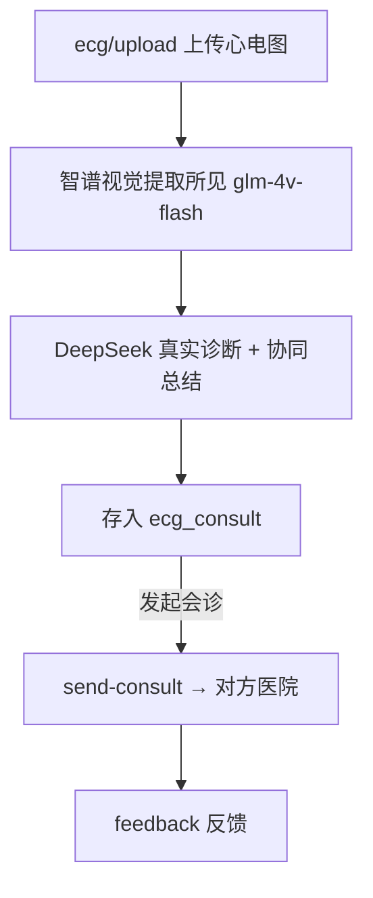
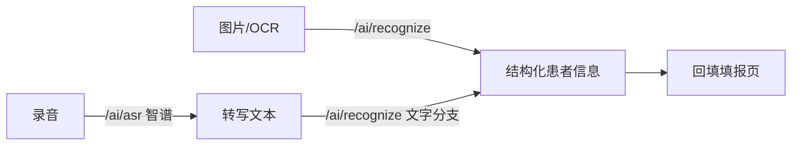

# App 医生端功能与业务流程

> 基于 `frontend/app/src/pages/`、`frontend/app/src/subPages/` 真实页面目录生成。App 端（UniApp + @wot-ui）是**医生日常工作入口**：建档、填报、远程心电、AI 辅助、随访、质控自评、三会、学院。

---

## 1. App 端功能地图

### 1.1 主包 `pages/`

| 页面目录 | 功能 | 后端接口前缀 |
|---|---|---|
| `index` | 首页（工作总览/待办） | `/doctor/stats` 等 |
| `case` | **建档 `create` / 填报 `fill` / 详情 / 时间轴 `timeline` / 单病例分析 `analysis`** | `/doctor/case/*`、`/case/*` |
| `ecg` | 远程心电：列表 / 上传 / 详情 | `/doctor/ecg/*` |
| `ai` | 「鲲仑·平安」：知识库问答 + OCR 识别 + 语音录入 | `/doctor/kb/ask`、`/ai/recognize`、`/ai/asr` |
| `analysis` | 质控分析 | `/doctor/stats/overview` |
| `selfcheck` | AI 模拟再认证自评（纯规则统计） | `/doctor/selfcheck` |
| `daily-report` | 日报 | `/doctor/stats` |
| `meeting` | 三会（例会/质量分析会/典型病例讨论）+ PPT 生成 | `/doctor/meeting/*` |
| `followup` | 随访计划/执行 | `/doctor/followup/*` |
| `academy` | 胸痛学院（课程/资料学习） | `/academy/doctor/*` |
| `work` | 工作台 | — |
| `mine` | 我的 | — |
| `unit` | 救治单元 | `/doctor/units` |
| `login` | 登录/注册/忘记密码 | `/auth/*` |

### 1.2 分包 `subPages/`

| 分包 | 功能 | 备注 |
|---|---|---|
| `about` | 关于 | — |
| `setting` | 设置 | — |
| `notices` | 公告 | — |
| `tickets` | 工单 | — |
| `profile` | 个人资料 | — |
| `module_cpx` | cpx 业务分包页 | — |
| `module_system` | 系统分包页 | — |
| `module_ai/chat` | 通用 AI 对话（**孤儿页**） | 无入口可达，用户已明确废弃 |
| `module_ai/ai-models` | AI 模型配置（孤儿页配套） | 同上 |

---

## 2. 核心业务流程（mermaid）

### 2.1 建档 → 填报 → 提交审核（医生主链路）

```mermaid
flowchart TD
  L[登录 /cpx/auth/login] --> H[首页 index]
  H --> C1[建档 create → /cpx/doctor/case/create]
  C1 --> F[填报 fill → 取模板 /cpx/doctor/templates]
  F -->|保存草稿| S[save → /cpx/doctor/case/{id}/save]
  F -->|提交| SUB[submit → /cpx/doctor/case/{id}/submit]
  SUB --> W[Web 审核员待审池]
  S -->|继续填| F
```

> 填报页 `fill.vue` 调用 `saveForm(caseId, {template_id, form_data})` **全量保存** 67 字段；老版本只存 6 字段会导致 Web 端"看不到全部填报数据"（旧病例数据已丢失，需重填）。

### 2.2 远程心电 + AI 诊断



### 2.3 AI 辅助录入



### 2.4 随访与三会

```mermaid
flowchart TD
  CASE[已审核病例] --> FG[/followup/generate 生成随访]
  FG --> FL[/followup/list 执行提交]
  CASE --> MT[/meeting/generate 三会 PPT]
  MT --> ML[/meeting/list 查看]
```

---

## 3. 关键页面说明

- **`case/fill.vue`（填报页）**：业务最常用页。注意 `card_type`(字典) ↔ `id_type`(表单) 的字段名映射；基本信息从建档页带入需两端同步扩充。
- **`ai` 页「鲲仑·平安」**：知识库问答走 `/cpx/doctor/kb/ask`（真实 LLM，超时 120s）；OCR/语音目前 App 端部分仍为前端 mock，待联调。
- **`selfcheck`**：名称带"AI"但**非 LLM**——纯规则统计（复用时间轴算达标率）。
- **`meeting`**：三会 PPT 由 `python-pptx` 后端生成，无 LLM。

---

## 4. App 端技术要点

- 框架：uni-app 3.0（Vue 3）+ @wot-ui/ui 2.2.0（组件库）+ @wot-ui/router。
- 状态：Pinia（`store/`：user/config/theme）+ 持久化。
- 请求：`@alova/adapter-uniapp`（非 axios）。
- 页面权威源：`pages.config.ts`（vite-plugin-uni-pages 每次 dev 覆盖 `pages.json`）。

---

## 5. 剔除声明

- `module_ai/chat` 与 `ai-models` 为**孤儿分包页**，无导航可达入口，不计入在用功能。
- App 端**不做**管理员式病例审核 UI（审核在 Web 端 `audit`）。
- App 端**不含**数据大屏（大屏在 Web `dashboard`）。
