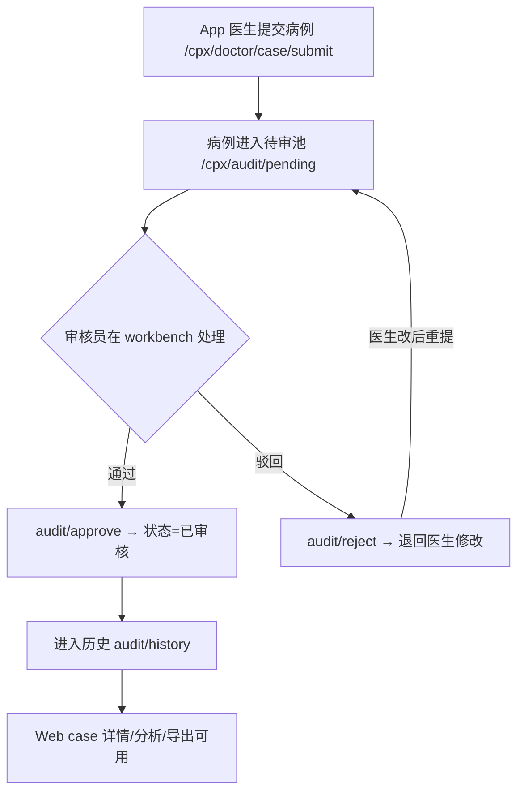
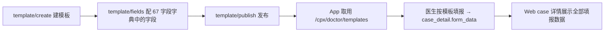

# Web 管理端功能与业务流程

> 基于 `frontend/web/src/views/cpx/`、`frontend/web/src/views/module_system/` 真实页面目录生成。Web 端定位为**管理后台/质控台**，由管理员、质控员、审核员使用；医生日常填报在 App 端完成。

---

## 1. Web 端功能地图

Web 端页面全部位于 `src/views/`，分两大域：

### 1.1 业务域 `views/cpx/`（胸痛中心业务）

| 页面目录 | 对应功能 | 后端接口前缀 |
|---|---|---|
| `dashboard` | 数据大屏（质控概览、核心指标可视化） | `/stats/dashboard` |
| `case` | 病例管理（列表/详情/时间轴/单病例分析/导出 Excel+PDF） | `/case/*` |
| `audit` | 三级审核（待审 pending / 工作台 workbench / 历史 history） | `/audit/*` |
| `template` | 动态填报模板管理（字段、Tab、发布） | `/template/*` |
| `hospital` | 医院/机构管理 | `/hospital/*` |
| `academy` | 胸痛学院（课程/资料管理） | `/academy/*` |
| `announcement` | 公告管理（发布/下线） | `/announcement/*` |
| `value_added` | 增值服务管理 | `/value-added/*` |
| `log` | 业务日志查看 | `/log/*` |
| `login` | 登录页 | `module_system/auth` |

### 1.2 系统基座 `views/module_system/`（脚手架 RBAC）

| 页面 | 功能 |
|---|---|
| `auth` | 登录/鉴权 |
| `dept` | 部门管理 |
| `dict` | 数据字典 |
| `log` | 系统日志 |
| `menu` | 菜单管理 |
| `notice` | 站内通知 |
| `params` | 系统参数 |
| `position` | 岗位管理 |
| `role` | 角色/权限 |

> `module_system` 是框架自带的通用后台能力，**与胸痛业务无直接耦合**，理解业务时先跳过，需要时再回看。

---

## 2. 核心业务流程（mermaid）

### 2.1 病例审核流程（Web 审核员视角）



### 2.2 模板驱动填报（管理员视角）



### 2.3 数据大屏与导出

```mermaid
flowchart TD
  S[/stats/dashboard 实时聚合] --> D[dashboard 大屏展示]
  C[case 列表] -->|导出| E1[/case/export Excel]
  C -->|导出| E2[/case/export_pdf 逐条]
  C -->|导出| E3[/case/export_pdf/{id} 单病例]
```

---

## 3. 关键页面说明

- **病例管理 `case`**：Web 端查看全部病例的"完整填报数据"。注意详情页遍历 `field_dict`（67 字段）与 `form_data` 并集渲染；空字段显示 `-`；`inpatient_no`/`discharge_date` 在"患者信息"模块单独显示。
- **审核 `audit`**：三态（待审/工作台/历史）。审核动作 `approve`/`reject` 写入 `audit_record` 并流转 `case_record` 状态。
- **模板 `template`**：业务核心配置页。字段来源 `fields.py`，支持 Tab 重排、复制标准模板、字段级增改删。
- **大屏 `dashboard`**：从 `statistic_daily` + 实时聚合取数，使用 ECharts 6 渲染。

---

## 4. Web 端技术要点

- 框架：Vue 3.5 + Vite 7 + TypeScript + Element Plus 2.14 + Pinia + Vue Router + vue-i18n（国际化）。
- 图表：ECharts 6（`@wot-ui` 不在 Web 端；Web 用 Element Plus 组件）。
- 接口层：`src/api/cpx/*` 与 `src/api/module_system/*` 两组，封装 axios 类请求。
- 路由：`src/router/` 动态加载（`route-loader` + `MenuProcessor`），配合路由守卫做鉴权。
- 状态：Pinia `src/store/modules/`（user/menu/dict/settings 等）。

---

## 5. 剔除声明

- Web 端**不含** AI 对话入口（`module_ai/chat` 孤儿页仅在 App 分包）。
- Web 端**不含**医生日常填报 UI（填报在 App `pages/case/fill.vue`）。
- 大屏数据来自系统内部聚合，**不依赖外部 DataMAX 服务**（DataMAX 为可选云端展示，非本仓库代码）。
