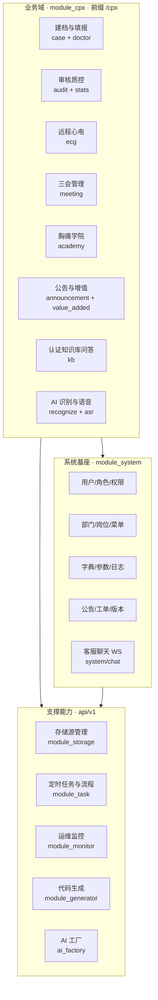

# 智慧胸痛中心管理平台 · 功能架构图

> 2026-08-31 基于当前代码重新生成。按「业务域 / 系统基座 / 支撑能力」三层划分，**仅列真实实现的功能**，剔除未接入页面的孤儿能力。

---

## 一、功能分层

---

## 二、业务域模块清单（真实）

| 模块 | 前缀 | 主要职责 |
|---|---|---|
| doctor | `/cpx/doctor` | 医生端主接口：建档、填报、AI 识别/ASR、心电图上传与诊断、知识库问答、自评、三会 |
| case | `/cpx/case` | 病例管理（Web 端） |
| audit | `/cpx/audit` | 病例三级审核（待审 / 工作台 / 历史） |
| template | `/cpx/template` | 动态填报模板（引用 67 字段字典） |
| hospital | `/cpx/hospital` | 医院/科室管理 |
| user | `/cpx/user` | 医院用户管理 |
| stats | `/cpx/stats` | 数据统计与质控指标 |
| academy | `/cpx/academy` | 胸痛学院（课程/资料） |
| announcement | `/cpx/announcement` | 公告管理 |
| value_added | `/cpx/value-added` | 增值服务管理 |
| auth | `/cpx/auth` | 业务侧登录认证 |
| log | `/cpx/log` | 业务日志 |

---

## 三、系统基座模块清单（真实）

| 模块 | 前缀 | 主要职责 |
|---|---|---|
| auth | `/auth` | 认证授权（JWT） |
| user / role / dept / position | `/user` `/role` `/dept` `/position` | RBAC 权限体系 |
| menu | `/menu` | 菜单与动态路由 |
| dict / params | `/dict` `/param` | 字典 / 参数 |
| log | `/log` | 操作日志 |
| notice / ticket / versions | `/notice` `/ticket` `/versions` | 公告 / 工单 / 版本 |
| chat | `/chat` | 客服聊天（WebSocket 真实功能） |

---

## 四、明确剔除 / 边界声明

| 项目 | 状态 | 说明 |
|---|---|---|
| DataMAX 大屏 | **外部服务，非本仓** | 云端 max.datahunter.cn，无前端代码，不列入系统功能 |
| module_ai/chat 通用 AI 对话 | **孤儿功能** | 后端接口与前端分包页均存在，但无任何页面入口可达，未接入业务，不计入在用功能 |
| SMTP 邮件 | **未实现** | 依赖中无邮件发送能力，不列出 |
| 第三方 OAuth 登录 | **未实现** | 鉴权为自研 JWT，无第三方 OAuth 接入 |
