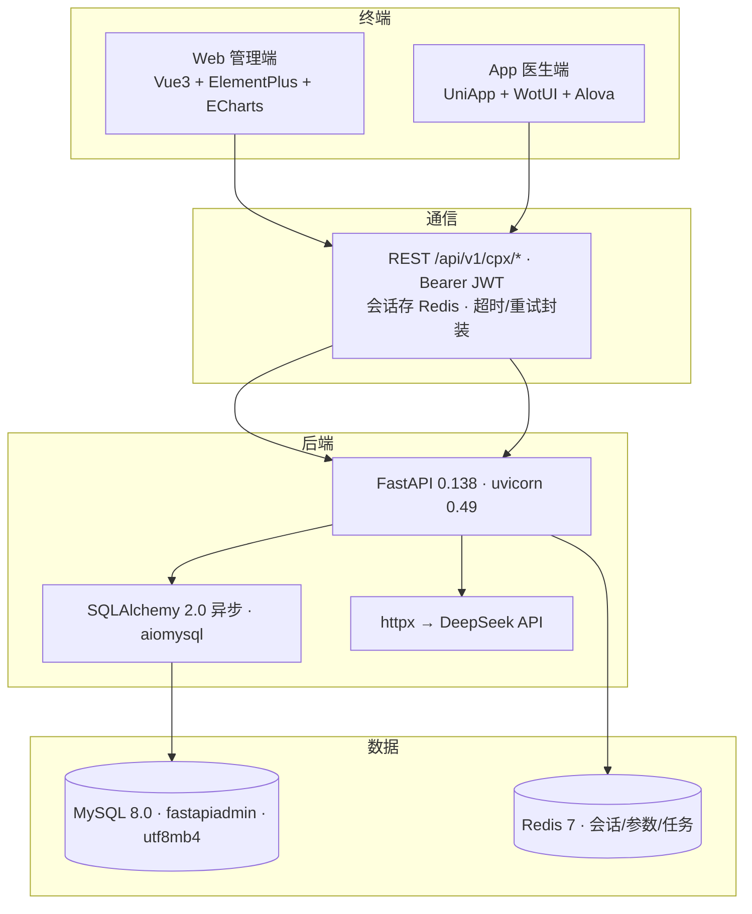

# 智慧胸痛中心管理系统 · 技术架构图

> 技术选型与架构分层（版本均来自真实依赖文件）。v3.1.0

---

## 一、总体技术栈

## 二、各层技术明细

### 终端层

| 端 | 技术栈 | 版本 |
|---|---|---|
| **Web 管理端** | Vue · Vite · TypeScript · Element Plus · ECharts · Pinia · vue-router · Tailwind | 3.5 / 7 / 6 / 2.14 / 6 / 3 / 5 / 4 |
| **App 医生端** | UniApp(H5/小程序/App) · Vue · WotUI · Pinia · Alova · vite-plugin-uni-pages · pnpm | 3.4 / 3 / 2 / 3 / 9 |

### 通信层
- 协议：REST（`/api/v1/cpx/*`），动态路由自动注册
- 认证：`Authorization: Bearer <JWT>`，会话存 Redis `cpx_session:{sid}`
- 数据格式：JSON；分页 `page_no/page_size`；统一响应 `{code, msg, data}`

### 后端层（backend/pyproject.toml 实证）

| 类别 | 组件 |
|---|---|
| 框架 | Python 3.12 · FastAPI 0.138 · uvicorn 0.49 · typer · pydantic-settings |
| ORM/DB | SQLAlchemy 2.0 异步 · aiomysql · asyncpg · psycopg · alembic 迁移 |
| 缓存/任务 | redis-py 7 异步 · APScheduler 3.11 |
| 网络 | httpx 0.28（AI/外部调用） |
| 安全 | pyjwt OAuth2 · cryptography(Fernet) · paramiko(SFTP) · boto3(S3) |
| 工具 | loguru · openpyxl · jinja2 · agno · sqlglot · ua-parser |

### 数据层
- **MySQL 8.0**：库 `fastapiadmin`，utf8mb4，20 张业务表，`case_detail.form_data` JSON 列（模板驱动动态表单）
- **Redis 7**：会话、系统参数、数据字典、定时任务 jobstore

### AI 服务
- **DeepSeek API**（OpenAI 兼容 `/chat/completions`）
  - `deepseek-v4-flash`：知识问答（kb/ask）、文字识别
  - `deepseek-v4-flash-vision-exp`：图片识别（本地图片转 base64 内联）

## 三、开发与部署

| 项 | 方式 |
|---|---|
| 后端依赖 | uv 0.12（`uv sync`，Python ≥3.12） |
| 前端依赖 | pnpm 9（web/app 各自 install） |
| 开发运行 | Web `pnpm dev`(5180) · App `pnpm dev`(5190) · 后端 `uv run uvicorn main:create_app`(8002) |
| 后端启动注意 | 必须 `ENVIRONMENT=dev`（读取 .env.dev 数据库密码） |
| 部署 | deploy.bat / deploy.sh / docker/ 可选；静态资源 static/uploads |
| 日志 | 运行日志 .workbuddy/tmp/uvicorn_8002.log |
