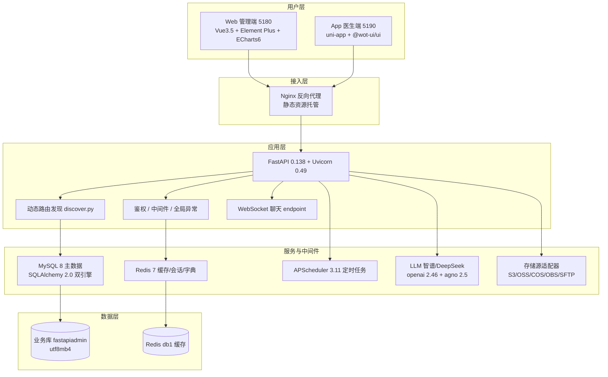

# 智慧胸痛中心管理平台 · 技术架构图

> 2026-08-31 基于当前代码重新生成。从「用户层 → 接入层 → 应用层 → 服务/中间件 → 数据层」五层描述技术栈与依赖，**仅标注真实引入的技术**。

---

## 一、五层技术架构

---

## 二、各层技术选型（真实版本）

| 层 | 技术 | 说明 |
|---|---|---|
| 用户层-Web | Vue `3.5.34` · Vite `7.1.5` · Element Plus `2.14.3` · ECharts `6.0.0` · Pinia `3.0.4` · vue-router `5.0.7` · axios `1.16.1` · UnoCSS · TypeScript `6.0.3` | 管理/质控端 |
| 用户层-App | uni-app `3.0` · @wot-ui/ui `2.2.0` · @alova/adapter-uniapp `2.0.16` · Pinia `2.3.1` · echarts `6.0.0` · TypeScript `5.5.4` | 编译目标：H5 / 微信小程序 / 多端小程序 / App |
| 接入层 | Nginx | docker 内置，反向代理 + 静态托管 |
| 应用层 | FastAPI `0.138.2` · Uvicorn `0.49.0` · Pydantic v2 · typer `0.26.7` · Alembic `1.18.4` · websockets `16` | ASGI 服务；动态路由免注册；CLI 提供 run/revision/upgrade |
| 数据-关系 | MySQL 8 · SQLAlchemy `2.0.51`（async aiomysql + sync pymysql） | 业务主库 |
| 数据-缓存 | Redis `7.1.0` | 会话 / 缓存 / 字典 / 参数 |
| 调度 | APScheduler `3.11` + croniter | 定时任务 / 工作流（module_task） |
| AI | openai `2.46.0` · agno `2.5.8` · 智谱 GLM-4V/GLM-ASR · DeepSeek | 仅 3 个真实 AI 功能（见系统流程图） |
| 存储 | boto3(S3) / cos-python-sdk-v5(COS) / esdk-obs(OBS) / alibabacloud-oss(OSS) / paramiko(SFTP) / cryptography(Fernet) | module_storage 真实适配器，可选外接 |
| 导出 | openpyxl `3.1.5`（Excel）· reportlab `5.0.1`（PDF） | 数据导出能力 |

---

## 三、关键架构特性

1. **动态路由（零注册）**：`core/discover.py` 扫描 `module_*/**/controller.py`，目录名 `module_xxx` → URL 前缀 `/xxx`。新增业务模块免路由注册。
2. **双数据库引擎**：`core/database.py` 同时持有同步（pymysql）与异步（aiomysql）引擎，SQLite 走 WAL，兼容脚本与高并发场景。
3. **统一响应与异常**：`common/response.py` + `core/exceptions.py` 全局收敛为 `SuccessResponse` / `ErrorResponse`。
4. **字段字典驱动**：`module_cpx/fields.py` 的 67 字段为填报体系唯一数据源，模板/前后端共享，保证三端一致。
5. **AI 调用统一走 OpenAI 兼容协议**：通过 `setting.py` 的配置切换智谱（视觉/语音）与 DeepSeek（文本/诊断），3 个真实功能以外不调用 LLM。

---

## 四、外部依赖边界

| 依赖 | 是否本仓代码 | 说明 |
|---|---|---|
| DataMAX 大屏 | 否（云端外部） | 可选展示层，无前端代码 |
| 云存储桶（S3/OSS/COS/OBS） | 否（外接） | 经 module_storage 适配器可选接入 |
| 第三方大模型平台 | 否（API） | 智谱 / DeepSeek 通过 API Key 调用 |
| MySQL / Redis | 否（基础设施） | docker 内置或本机部署 |
