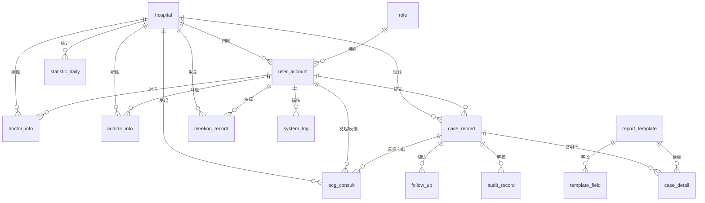

# 数据模型 ER 图与 API 接口设计

> 本文档基于当前真实代码（`backend/app/plugin/module_cpx/models.py`、`backend/app/plugin/module_cpx/*/controller.py`）生成，所有表名、外键、接口路径均为代码实测结果。**不含任何虚构字段或接口。**

---

## 1. 业务数据模型（ER 图）

胸痛中心业务数据全部位于 `module_cpx` 插件，共 **20 张表**。核心实体关系如下（mermaid erDiagram）：



### 1.1 表清单与职责

| 表名 | 模型类 | 职责 | 关键外键 |
|---|---|---|---|
| `hospital` | HospitalModel | 医院/胸痛中心机构主数据 | — |
| `role` | CpxRoleModel | 业务侧角色（医生/审核员/管理员） | — |
| `user_account` | UserAccountModel | 业务用户账户（JWT 登录） | role_id→role, hospital_id→hospital |
| `doctor_info` | DoctorInfoModel | 医生档案 | user_id→user_account, hospital_id→hospital |
| `auditor_info` | AuditorInfoModel | 审核员档案 | user_id→user_account, hospital_id→hospital |
| `case_record` | CaseRecordModel | **病例主表**（建档/状态流转核心） | hospital_id→hospital, doctor_id→user_account |
| `case_detail` | CaseDetailModel | 病例填报明细（JSON 全量字段） | case_id→case_record, template_id→report_template |
| `audit_record` | AuditRecordModel | 三级审核记录 | case_id→case_record, auditor_id→user_account |
| `report_template` | ReportTemplateModel | 动态填报模板（67 字段字典驱动） | — |
| `template_field` | TemplateFieldModel | 模板字段定义 | template_id→report_template |
| `follow_up` | FollowUpModel | 随访计划/记录 | case_id→case_record, hospital_id, doctor_id |
| `treatment_unit` | TreatmentUnitModel | 救治单元（科室/胸痛单元） | hospital_id→hospital |
| `ecg_consult` | EcgConsultModel | 远程心电会诊（含 AI 诊断/协同总结） | case_id→case_record, hospital_id, doctor_id, target_hospital_id, target_doctor_id, feedback_doctor_id |
| `meeting_record` | MeetingRecordModel | 三会（例会/质量分析会/典型病例讨论）记录 | hospital_id, doctor_id |
| `academy_content` | AcademyContentModel | 胸痛学院课程/资料 | — |
| `system_log` | SystemLogModel | 业务操作日志 | user_id→user_account, hospital_id→hospital |
| `statistic_daily` | StatisticDailyModel | 每日质控统计快照 | hospital_id→hospital |
| `ai_kb_chunk` | AiKbChunkModel | 认证知识库分片（PDF 灌库） | — |
| `announcement` | AnnouncementModel | 公告 | — |
| `value_added_service` | ValueAddedServiceModel | 增值服务项 | — |

### 1.2 填报体系要点（字段字典驱动）

- 标准字段唯一数据源：`backend/app/plugin/module_cpx/fields.py`（**67 个字段**，field_code 英文编码）。
- 模板 `report_template` + `template_field` 决定一次填报展示哪些字段、分几个 Tab。
- 病例填报结果以 **JSON** 形式整体存入 `case_detail.form_data`，不逐字段落列——所以"加字段"主要在字典与模板层完成，无需改表结构。
- **前后端键名差异（历史坑）**：`case/detail` 返回的 `field_dict`（=fields.py）元素键是 `code/name/type/options`；`template_fields` 元素键是 `field_code/field_name/field_type/field_options`。前端需用 `f.code ?? f.field_code` 兼容。

---

## 2. API 接口设计

- 基础路径前缀：`/api/v1/cpx`
- 路由机制：`core/discover.py` 扫描 `module_*/**/controller.py`，目录名 `module_cpx` 自动映射为 `/cpx`，子目录名（如 `doctor`）映射为二级前缀。
- 鉴权：业务侧 `POST /cpx/auth/login` 签发 JWT；管理端另走 `module_system/auth`。

### 2.1 模块接口总览

| 子模块 | 前缀 | 主要接口 |
|---|---|---|
| doctor（医生端主接口） | `/doctor` | 建档/填报/保存/提交、模板取用、字段字典、时间轴、单病例分析、随访生成、远程心电上传/列表/详情/发起会诊/反馈、自评、知识库问答、AI 识别、语音识别、三会生成、图片上传 |
| case（Web 病例管理） | `/case` | 列表、详情、时间轴、分析、导出 Excel、导出 PDF、创建、提交、更新、删除 |
| audit（三级审核） | `/audit` | 工作台、待审、详情、通过、驳回、历史、记录更新 |
| template（动态模板） | `/template` | 列表/详情/创建/更新/发布/停用、字段增改删、复制标准模板、Tab 改名/删除 |
| hospital（医院管理） | `/hospital` | 列表/全部/详情/创建/更新/批量状态 |
| user（业务用户） | `/user` | 医生列表、审核员列表、医生/审核员创建更新、批量状态、改密 |
| academy（胸痛学院） | `/academy` | 列表/详情/创建/更新/删除/发布、资料上传、医生端列表/详情 |
| announcement（公告） | `/announcement` | 列表/详情/创建/更新/发布/下线/删除、生效列表 |
| value_added（增值服务） | `/value-added` | 列表 |
| stats（质控统计） | `/stats` | 数据大屏 dashboard、分析 analysis |
| ecg（远程心电，归在 doctor 下） | `/doctor/ecg/*` | 上传、列表、详情、发起会诊、反馈 |
| auth（业务登录） | `/auth` | 登录、登出、用户信息 |
| log（业务日志） | `/log` | 角色列表、日志列表 |
| selfcheck（AI 模拟再认证自评） | `/doctor/selfcheck` | 自评统计（纯规则，无 LLM） |

### 2.2 doctor 子模块完整接口（核心）

```
GET    /cpx/doctor/stats                      医生端统计
GET    /cpx/doctor/me                         当前医生信息
GET    /cpx/doctor/templates                  可用填报模板
POST   /cpx/doctor/case/create                 建档
PUT    /cpx/doctor/case/{id}                  更新病例
POST   /cpx/doctor/case/{id}/save             保存填报（草稿）
POST   /cpx/doctor/case/{id}/submit           提交审核
GET    /cpx/doctor/case/list                  病例列表
GET    /cpx/doctor/field-dict                 67 字段字典
GET    /cpx/doctor/case/{id}/timeline         时间轴
GET    /cpx/doctor/case/{id}/analysis         单病例分析
GET    /cpx/doctor/case/{id}                  病例详情
DELETE /cpx/doctor/case/{id}                  删除病例
POST   /cpx/doctor/password                   修改密码
POST   /cpx/doctor/followup/generate          生成随访
GET    /cpx/doctor/followup/list              随访列表
GET    /cpx/doctor/followup/groups            随访分组
POST   /cpx/doctor/followup/{id}/submit       提交随访
GET    /cpx/doctor/stats/overview             概览统计
GET    /cpx/doctor/units                      救治单元
POST   /cpx/doctor/ecg/upload                 心电图上传（触发 AI 诊断+协同总结）
GET    /cpx/doctor/ecg/list                    心电图列表
GET    /cpx/doctor/ecg/detail/{id}            心电图详情
POST   /cpx/doctor/ecg/send-consult/{id}      发起远程会诊
POST   /cpx/doctor/ecg/feedback/{id}          会诊反馈
GET    /cpx/doctor/selfcheck                  再认证自评
POST   /cpx/doctor/kb/ask                     认证知识库问答（LLM）
POST   /cpx/doctor/ai/recognize               数据填报 AI 识别（图片→智谱/文字→DeepSeek）
POST   /cpx/doctor/ai/asr                      语音识别 ASR（智谱 glm-asr-2512）
GET    /cpx/doctor/meeting/templates          三会模板
POST   /cpx/doctor/meeting/generate           三会 PPT 生成（python-pptx）
GET    /cpx/doctor/meeting/list                三会列表
GET    /cpx/doctor/meeting/{id}               三会详情
DELETE /cpx/doctor/meeting/{id}               删除三会
POST   /cpx/doctor/upload/image               图片上传
```

> 完整接口（含 case/audit/template 等）可在后端启动后访问 `http://<host>:8002/api/v1/docs`（Swagger）实时查看——这是最权威的接口清单。

### 2.3 三个在用 AI 接口（明确边界）

1. `POST /cpx/doctor/kb/ask` —— 认证知识库问答，知识来源于 `ai_kb_chunk` 表（PDF 由 `backend/scripts/import_kb_pdf.py` 灌库）。
2. `POST /cpx/doctor/ai/recognize` —— 数据填报 AI 识别（图片分支走智谱视觉，文字分支走 DeepSeek）。
3. `POST /cpx/doctor/ecg/upload` —— 心电图 AI 诊断 + 协同总结（DeepSeek 真实输出，附智谱视觉所见）。

> 注意：`/ai/chat`（module_ai/chat 通用对话）为**孤儿功能**，接口与 App 分包页均在但无入口可达，不计入在用业务接口。

---

## 3. 剔除声明（避免误导）

- **无独立"患者表"**：患者信息作为 `case_record` + `case_detail.form_data` 的一部分存储，不单独建表。
- **无 WebSocket 业务接口**：WebSocket 仅存在于管理端 `module_system/chat`（人工客服/群聊），不在 cpx 业务域内。
- **无 SMTP/邮件接口**：系统通知通过站内公告（`announcement`）与前端消息实现，无邮件发送能力。
- **AI 识别/问答均走真实 LLM**：不存在"假数据"接口（早期静默兜底已改为真实调用）。
