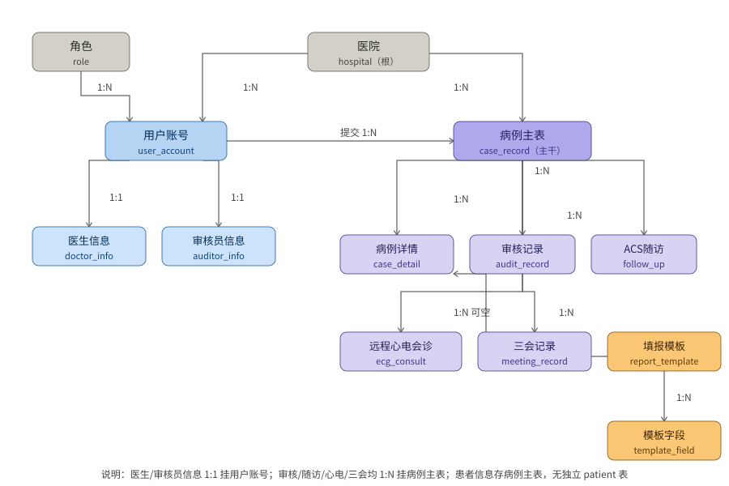

# 数据模型 ER 图与 API 接口设计

> 生成日期：2026-09-07（基于当前真实代码**重新生成**，字段级实测）
> 数据来源：`backend/app/plugin/module_cpx/models.py`（20 张 ORM 模型，含字段注释）、`module_cpx/*/controller.py`（116 个业务接口）、`backend/app/api/v1/**/controller.py`（系统基座 214 个）
> 说明：全部表名、字段、类型、注释、外键、接口路径均从代码实测提取，无虚构。

---

# 第一部分：数据模型

## 1.1 表清单总览（20 张）

| # | 表名 | 中文名 | 用途 |
|---|---|---|---|
| 1 | `hospital` | 医院信息表 | 医院基础档案 |
| 2 | `role` | 角色表 | 业务角色（admin/auditor/doctor） |
| 3 | `user_account` | 用户账号表 | 登录账号与角色绑定 |
| 4 | `doctor_info` | 医生信息表 | 医生扩展信息（工号/科室/职称） |
| 5 | `auditor_info` | 审核员信息表 | 审核员扩展信息（审核权限） |
| 6 | `case_record` | 病例主表 | **系统主干**：一次就诊 |
| 7 | `case_detail` | 病例详情表 | 按模板填写的表单内容 |
| 8 | `audit_record` | 审核记录表 | 各级审核结论 |
| 9 | `report_template` | 填报模板表 | 表单模具 |
| 10 | `template_field` | 模板字段表 | 模板的字段定义 |
| 11 | `follow_up` | ACS随访管理表 | 出院随访计划与记录 |
| 12 | `treatment_unit` | 胸痛救治单元表 | 救治单元（挂医院） |
| 13 | `ecg_consult` | 远程心电AI诊断与会诊表 | 心电上传/AI 诊断/会诊 |
| 14 | `meeting_record` | 三会PPT生成记录表 | 三会（质量/联合/病例讨论） |
| 15 | `academy_content` | 胸痛学院内容表 | 学习资源 |
| 16 | `system_log` | 系统操作日志 | 操作留痕 |
| 17 | `statistic_daily` | 每日统计表 | 每日病例/审核统计 |
| 18 | `ai_kb_chunk` | AI助手知识库分片 | 知识库文本分片 |
| 19 | `announcement` | 公告表 | 通知公告 |
| 20 | `value_added_service` | 增值服务表 | 增值服务卡片 |

> 约定：全部继承 `MappedBase`；主键统一 `BigInteger`；时间字段 `create_time / update_time` 由 MySQL 处理；**无软删除**（物理删除）。

## 1.2 ER 图（实体—关系说明）

> 原 Mermaid 图渲染失败，改为下方中文 SVG 图 + 文字关系说明，保证任意查看器可见。括号内为代码真实表名，不可改名。

**根实体：医院（hospital）** —— 一对多（1:N）关联：
- 用户账号（user_account）· 所属医院
- 医生信息（doctor_info）· 所属医院
- 审核员信息（auditor_info）· 所属医院
- 病例主表（case_record）· 所属医院
- 胸痛救治单元（treatment_unit）· 所属医院
- ACS 随访（follow_up）· 所属医院
- 远程心电会诊（ecg_consult）· 发起医院
- 三会记录（meeting_record）· 所属医院
- 每日统计（statistic_daily）· 按院统计

**根实体：角色（role）** —— 一对多（1:N）用户账号（user_account）· 角色绑定

**根实体：用户账号（user_account）** —— 人员主索引，一对一 / 一对多关联：
- 一对一（1:1）医生信息（doctor_info）· 医生扩展
- 一对一（1:1）审核员信息（auditor_info）· 审核员扩展
- 一对多（1:N）病例主表（case_record）· 提交医生
- 一对多（1:N）审核记录（audit_record）· 审核员
- 一对多（1:N）ACS 随访（follow_up）· 随访医生
- 一对多（1:N）远程心电会诊（ecg_consult）· 发起 / 反馈医生
- 一对多（1:N）三会记录（meeting_record）· 生成医生
- 一对多（1:N）系统日志（system_log）· 操作人

**主干实体：病例主表（case_record）** —— 一次就诊，一对多（1:N）挂载所有事件：
- 病例详情（case_detail）· 填报明细（经 template_id 引用模板）
- 审核记录（audit_record）
- ACS 随访（follow_up）· 随访计划
- 远程心电会诊（ecg_consult）· 关联病例（case_id 可空，可先发起后关联）
- 三会记录（meeting_record）· 三会关联病例

**配置实体：填报模板（report_template）** —— 一对多（1:N）：
- 病例详情（case_detail）· 被引用
- 模板字段（template_field）· 字段定义

> 关系记号：1:1 = 一对一，1:N = 一对多。新增业务只需加表 + 挂 `case_id` 外键即可纳入主干。

**主干说明**：`case_record` 是主干（一次就诊），`case_detail / audit_record / follow_up / ecg_consult / meeting_record` 均经 `case_id` 挂载，代表"这次就诊发生的事件"。新增业务只需加表 + `case_id` 外键。

## 1.3 表字段详表（字段级实测）

### 1. hospital（医院信息表）
| 字段 | 类型 | 说明 |
|---|---|---|
| id | bigint PK | 医院ID |
| hospital_name | varchar(100) | 医院名称 |
| hospital_level | varchar(50) | 医院等级 |
| province / city | varchar(50) | 省 / 城市 |
| address | varchar(255) | 详细地址 |
| contact_name / contact_phone | varchar(50)/(20) | 联系人 / 电话 |
| status | smallint | 1正常 0禁用 |
| create_time / update_time | datetime | 创建 / 更新 |

### 2. role（角色表）
| 字段 | 类型 | 说明 |
|---|---|---|
| id | bigint PK | 角色ID |
| role_name | varchar(50) | 角色名称（管理员/审核员/医生） |
| description | varchar(255) | 角色描述 |
| create_time | datetime | 创建时间 |

### 3. user_account（用户账号表）
| 字段 | 类型 | 说明 |
|---|---|---|
| id | bigint PK | 用户ID |
| username | varchar(50) | 登录账号 |
| password | varchar(255) | 密码（加密存储） |
| real_name | varchar(50) | 姓名 |
| phone | varchar(20) | 手机号 |
| role_id | bigint FK→role.id | 角色ID |
| hospital_id | bigint FK→hospital.id | 所属医院 |
| status | smallint | 1正常 0禁用 |
| last_login_time | datetime | 最后登录时间 |
| create_time / update_time | datetime | 创建 / 更新 |

### 4. doctor_info（医生信息表）
| 字段 | 类型 | 说明 |
|---|---|---|
| id | bigint PK | — |
| user_id | bigint FK→user_account.id | 用户ID |
| hospital_id | bigint FK→hospital.id | 医院ID |
| doctor_no | varchar(50) | 医生工号 |
| department | varchar(50) | 科室 |
| title | varchar(50) | 职称 |
| create_time | datetime | 创建时间 |

### 5. auditor_info（审核员信息表）
| 字段 | 类型 | 说明 |
|---|---|---|
| id | bigint PK | — |
| user_id | bigint FK→user_account.id | 用户ID |
| hospital_id | bigint FK→hospital.id | 所属医院 |
| audit_level | varchar(50) | 审核权限（分级） |
| create_time | datetime | 创建时间 |

### 6. case_record（病例主表）★核心
| 字段 | 类型 | 说明 |
|---|---|---|
| id | bigint PK | — |
| case_no | varchar(50) | 病例编号（建档时生成） |
| hospital_id | bigint FK→hospital.id | 医院ID |
| doctor_id | bigint FK→user_account.id | 提交医生 |
| patient_name | varchar(50) | 患者姓名 |
| gender | varchar(10) | 性别 |
| age | int | 年龄 |
| phone | **EncryptedString(255)** | 联系电话（加密） |
| first_contact_time | datetime | 首次医疗接触时间 |
| id_type | varchar(30) | 证件类型 身份证/社保卡/其他 |
| id_number | **EncryptedString(255)** | 证件号码（加密） |
| birth_date | datetime | 出生日期 |
| onset_address | varchar(200) | 发病地址 |
| detail_address | varchar(500) | 详细地址 |
| insurance_type | varchar(30) | 医保类型 |
| insurance_no | **EncryptedString(255)** | 医保编号（加密） |
| come_type | varchar(20) | 来院方式 120/自行/转诊 |
| diagnose_type | varchar(30) | 诊断类型 STEMI/NSTEMI/UA/主动脉夹层/肺栓塞/低危胸痛 |
| status | varchar(20) | draft草稿 / submitted待审核 / approved通过 / rejected驳回 |
| create_time / update_time | datetime | 创建 / 更新 |

### 7. case_detail（病例详情表）
| 字段 | 类型 | 说明 |
|---|---|---|
| id | bigint PK | — |
| case_id | bigint FK→case_record.id | 病例ID |
| template_id | bigint FK→report_template.id | 模板ID |
| form_data | **EncryptedJson** | 动态表单数据（加密 JSON） |
| create_time / update_time | datetime | 创建 / 更新 |

### 8. audit_record（审核记录表）
| 字段 | 类型 | 说明 |
|---|---|---|
| id | bigint PK | — |
| case_id | bigint FK→case_record.id | 病例ID |
| auditor_id | bigint FK→user_account.id | 审核员ID |
| audit_result | varchar(20) | pass通过 / reject驳回 |
| audit_comment | text | 审核意见 |
| audit_time | datetime | 审核时间 |

### 9. report_template（填报模板表）
| 字段 | 类型 | 说明 |
|---|---|---|
| id | bigint PK | — |
| template_name | varchar(100) | 模板名称 |
| version | varchar(20) | 版本号 |
| status | smallint | 1启用 0停用 |
| published | smallint | 0未发布 1已发布 |
| creator_id | bigint | 创建人 |
| create_time / update_time | datetime | 创建 / 更新 |

### 10. template_field（模板字段表）
| 字段 | 类型 | 说明 |
|---|---|---|
| id | bigint PK | — |
| template_id | bigint FK→report_template.id | 模板ID |
| tab_name | varchar(50) | 所属分类名称 |
| tab_order | int | 分类排序 |
| field_name | varchar(100) | 字段名称 |
| field_code | varchar(50) | 字段编码（对应 67 字段字典） |
| field_type | varchar(30) | text/number/date/time/datetime/select/image |
| field_options | json | 选项（select 类型用） |
| required_flag | smallint | 1必填 0选填 |
| sort_num | int | 排序 |
| create_time | datetime | 创建时间 |

### 11. follow_up（ACS随访管理表）
| 字段 | 类型 | 说明 |
|---|---|---|
| id | bigint PK | — |
| case_id | bigint FK→case_record.id | 病例ID |
| patient_name | varchar(50) | 患者姓名 |
| hospital_id | bigint FK→hospital.id | 医院ID |
| doctor_id | bigint FK→user_account.id | 创建医生 |
| plan_month | int | 随访计划 1/3/6/12 月 |
| due_date | datetime | 应随访日期 |
| status | varchar(20) | pending随访中 / submitted已提交 / overdue已过期 |
| follow_date | datetime | 实际随访日期 |
| follow_status | varchar(20) | followed已随访 / unfollowed未随访 |
| survival_status | varchar(20) | alive存活 / dead死亡 / unknown未知 |
| risk_control | varchar(200) | 危险因素控制 |
| medication | varchar(500) | 用药情况 |
| remark | varchar(500) | 备注 |
| form_data | text | 随访表单扩展数据 JSON（分组字段） |
| create_time / update_time | datetime | 创建 / 更新 |

### 12. treatment_unit（胸痛救治单元表）
| 字段 | 类型 | 说明 |
|---|---|---|
| id | bigint PK | — |
| unit_name | varchar(100) | 单元名称 |
| hospital_id | bigint FK→hospital.id | 所属医院 |
| contact_name / contact_phone | varchar(50)/(20) | 联系人 / 电话 |
| status | smallint | 1启用 0停用 |
| create_time | datetime | 创建时间 |

### 13. ecg_consult（远程心电AI诊断与会诊表）
| 字段 | 类型 | 说明 |
|---|---|---|
| id | bigint PK | — |
| case_id | bigint FK→case_record.id **可空** | 关联病例（可先发起后关联） |
| hospital_id | bigint FK→hospital.id | 发起医院 |
| doctor_id | bigint FK→user_account.id | 发起医生 |
| target_hospital_id | bigint FK→hospital.id | 接收会诊医院（未选则仅 AI 诊断） |
| target_doctor_id | bigint FK→user_account.id | 接收会诊医生 |
| image_path | varchar(500) | 心电图图片路径 |
| patient_info_json | text | 上传时病例基础信息快照 JSON |
| ai_diagnosis | text | AI 诊断意见 |
| ai_summary | text | AI 协同意见总结（发接收方） |
| feedback | text | 接收方反馈意见 |
| feedback_doctor_id | bigint FK→user_account.id | 反馈医生 |
| feedback_time | datetime | 反馈时间 |
| status | varchar(20) | draft/uploaded/consult_sent/received/closed |
| create_time / update_time | datetime | 创建 / 更新 |

### 14. meeting_record（三会PPT生成记录表）
| 字段 | 类型 | 说明 |
|---|---|---|
| id | bigint PK | — |
| meeting_type | varchar(30) | quality质量分析 / joint联合例会 / case典型病例讨论 |
| title | varchar(100) | 标题 |
| hospital_id | bigint FK→hospital.id | 医院 |
| doctor_id | bigint FK→user_account.id | 生成医生 |
| case_id | bigint | 典型病例讨论会关联病例ID |
| start_date / end_date | datetime | 统计起止 |
| file_path | varchar(300) | PPT 文件路径 |
| file_size | int | 文件大小 |
| create_time | datetime | 生成时间 |

### 15. academy_content（胸痛学院内容表）
| 字段 | 类型 | 说明 |
|---|---|---|
| id | bigint PK | — |
| title | varchar(200) | 标题 |
| content_type | varchar(20) | video/ppt/doc/pdf/other |
| category | varchar(50) | 分类（指南共识/培训课程/学术会议） |
| summary | text | 简介 |
| file_path | varchar(300) | 文件相对路径（static 下） |
| file_name | varchar(200) | 原始文件名 |
| file_size | bigint | 文件大小（字节） |
| cover_path | varchar(300) | 封面图 |
| published | smallint | 0草稿 1发布 |
| sort_num | int | 排序 |
| view_count / download_count | int | 浏览量 / 下载量 |
| creator_id | bigint | 创建人 |
| create_time / update_time | datetime | 创建 / 更新 |

### 16. system_log（系统操作日志）
| 字段 | 类型 | 说明 |
|---|---|---|
| id | bigint PK | — |
| user_id | bigint FK→user_account.id | 操作用户 |
| module | varchar(50) | 模块 |
| operation | varchar(100) | 操作类型 |
| description | text | 操作描述 |
| ip_address | varchar(50) | IP 地址 |
| result | varchar(20) | success成功 / fail失败 |
| create_time | datetime | 创建时间 |

### 17. statistic_daily（每日统计表）
| 字段 | 类型 | 说明 |
|---|---|---|
| id | bigint PK | — |
| hospital_id | bigint FK→hospital.id | 医院ID |
| stat_date | date | 统计日期 |
| case_count / audit_count | int | 病例数 / 审核数 |
| pass_count / reject_count | int | 通过数 / 驳回数 |
| create_time | datetime | 创建时间 |

### 18. ai_kb_chunk（AI助手知识库分片）
| 字段 | 类型 | 说明 |
|---|---|---|
| id | bigint PK | — |
| source_file | varchar(200) | 来源文件名 |
| page_no | int | 来源页码 |
| chunk_index | int | 文件内分片序号 |
| content | text | 分片内容 |
| create_time | datetime | 导入时间 |

### 19. announcement（公告表）
| 字段 | 类型 | 说明 |
|---|---|---|
| id | bigint PK | — |
| title | varchar(80) | 公告标题 |
| subtitle | varchar(120) | 副标题 / banner 显示 |
| content | text | 详情内容（HTML/Markdown） |
| cover | varchar(500) | 详情页封面图 |
| type | varchar(30) | system/version/activity/notice |
| sort_order | int | 排序（值大者靠前） |
| status | varchar(20) | draft/published/offline |
| published_at | datetime | 发布时间 |
| expires_at | datetime | 失效时间（null=永久） |
| creator_id | bigint | 创建人 |
| remark | varchar(500) | 备注 |
| create_time / update_time | datetime | 创建 / 更新 |

### 20. value_added_service（增值服务表）
| 字段 | 类型 | 说明 |
|---|---|---|
| id | bigint PK | — |
| name | varchar(100) | 服务名称 |
| subtitle | varchar(120) | 副标题 |
| icon | varchar(500) | 图标 URL/路径 |
| cover | varchar(500) | 大卡片背景图 |
| link_type | varchar(20) | h5/external/internal |
| link_url | varchar(500) | 跳转 URL |
| sort_order | int | 排序 |
| status | varchar(20) | draft/online/offline |
| creator_id | bigint | 创建人 |
| remark | varchar(500) | 备注 |
| create_time / update_time | datetime | 创建 / 更新 |

## 1.4 外键关系一览

| 子表.字段 | → 父表.字段 | 关系 | 可空 |
|---|---|---|---|
| user_account.role_id | → role.id | N:1 | 否 |
| user_account.hospital_id | → hospital.id | N:1 | 是 |
| doctor_info.user_id | → user_account.id | 1:1 | 否 |
| doctor_info.hospital_id | → hospital.id | N:1 | 否 |
| auditor_info.user_id | → user_account.id | 1:1 | 否 |
| auditor_info.hospital_id | → hospital.id | N:1 | 否 |
| case_record.hospital_id | → hospital.id | N:1 | 否 |
| case_record.doctor_id | → user_account.id | N:1 | 否 |
| case_detail.case_id | → case_record.id | N:1 | 否 |
| case_detail.template_id | → report_template.id | N:1 | 否 |
| audit_record.case_id | → case_record.id | N:1 | 否 |
| audit_record.auditor_id | → user_account.id | N:1 | 否 |
| template_field.template_id | → report_template.id | N:1 | 否 |
| follow_up.case_id | → case_record.id | N:1 | 否 |
| follow_up.hospital_id / doctor_id | → hospital.id / user_account.id | N:1 | 否 |
| treatment_unit.hospital_id | → hospital.id | N:1 | 否 |
| **ecg_consult.case_id** | → case_record.id | N:1 | **是（可空）** |
| ecg_consult.hospital_id / doctor_id / target_hospital_id / target_doctor_id / feedback_doctor_id | → hospital.id / user_account.id | N:1 | 是 |
| meeting_record.hospital_id / doctor_id | → hospital.id / user_account.id | N:1 | 否 |
| system_log.user_id | → user_account.id | N:1 | 是 |
| statistic_daily.hospital_id | → hospital.id | N:1 | 否 |

## 1.5 加密字段（患者隐私 PII）

以下字段使用 `EncryptedString` / `EncryptedJson`（Fernet，`backend/app/core/crypto.py`），**ORM 层自动加解密**，业务代码无感：

| 表 | 字段 | 类型 |
|---|---|---|
| case_record | phone / id_number / insurance_no | EncryptedString(255) |
| case_detail | form_data | EncryptedJson |

> 硬性要求：加密列必须加宽至 `VARCHAR(255)`（密文约 100+ 字符）。姓名/地址未加密（保留搜索能力）。

---

# 第二部分：API 接口设计

## 2.1 接口规范

| 项 | 说明 |
|---|---|
| 风格 | RESTful，JSON 收发 |
| 业务前缀 | `/api/v1/cpx/*`（胸痛业务） |
| 系统前缀 | `/api/v1/*`（框架基座） |
| 鉴权 | JWT Bearer；业务侧接口级角色校验 `BusinessRole([admin/auditor/doctor])` |
| 响应 | 统一封装（`app/common`） |
| 文档 | Swagger `http://localhost:8002/api/v1/docs`（开发环境） |
| 路由机制 | 自动发现：`module_*/**/controller.py` → 目录名转 URL 前缀（零注册） |

**接口规模**：业务接口 **116 个**（12 子模块）+ 系统基座 **214 个**（26 个 controller）。

## 2.2 业务接口全量清单（116 个）

### auth（3）— 业务认证
| 方法 | 路径 | 说明 |
|---|---|---|
| POST | `/api/v1/cpx/auth/login` | 业务登录 |
| POST | `/api/v1/cpx/auth/logout` | 业务登出 |
| GET | `/api/v1/cpx/auth/userinfo` | 当前用户信息 |

### doctor（37）— 医生端主接口 ★核心
| 方法 | 路径（省略 `/api/v1/cpx`） | 说明 |
|---|---|---|
| GET | `/doctor/stats` | 医生工作台统计 |
| GET | `/doctor/me` | 当前医生基本信息 |
| GET | `/doctor/templates` | 已发布模板列表（含字段） |
| POST | `/doctor/case/create` | 患者快速建档（生成病例编号） |
| PUT | `/doctor/case/{id}` | 更新患者基础信息 |
| POST | `/doctor/case/{id}/save` | 保存病例表单（草稿） |
| POST | `/doctor/case/{id}/submit` | 提交病例审核 |
| GET | `/doctor/case/list` | 我的病例列表 |
| GET | `/doctor/field-dict` | 胸痛标准字段字典（67 字段） |
| GET | `/doctor/case/{id}/timeline` | 救治时间轴（含关键指标） |
| GET | `/doctor/case/{id}/analysis` | 单病例质控分析 |
| GET | `/doctor/case/{id}` | 病例详情（含审核反馈） |
| DELETE | `/doctor/case/{id}` | 删除我的病例（仅本人，级联） |
| POST | `/doctor/password` | 修改登录密码 |
| POST | `/doctor/followup/generate` | 为已通过病例生成随访计划 |
| GET | `/doctor/followup/list` | 我的随访列表 |
| GET | `/doctor/followup/groups` | 随访按患者聚合列表 |
| GET | `/doctor/followup/{id}` | 随访单条详情（含患者上下文） |
| POST | `/doctor/followup/{id}/submit` | 提交随访表单 |
| GET | `/doctor/stats/overview` | 数据概览（累计/诊断分布/趋势） |
| GET | `/doctor/units` | 救治医院列表 |
| POST | `/doctor/ecg/upload` | 远程心电上传（AI 诊断 + 病例快照） |
| GET | `/doctor/ecg/list` | 远程心电记录列表（发起+接收合并） |
| GET | `/doctor/ecg/list-by-case/{case_id}` | 某病例心电记录列表 |
| GET | `/doctor/ecg/detail/{id}` | 远程心电详情 |
| POST | `/doctor/ecg/send-consult/{id}` | 申请协同会诊（选接收医院） |
| POST | `/doctor/ecg/feedback/{id}` | 接收方医生写反馈（结束会诊） |
| GET | `/doctor/selfcheck` | AI 模拟再认证自评 |
| POST | `/doctor/kb/ask` | 认证知识库 AI 问答（标注来源文件与页码） |
| POST | `/doctor/ai/recognize` | AI 图片/文字识别提取患者信息 |
| POST | `/doctor/ai/asr` | AI 语音识别（音频转写） |
| GET | `/doctor/meeting/templates` | 三会模板列表 |
| POST | `/doctor/meeting/generate` | 生成三会 PPT |
| GET | `/doctor/meeting/list` | 三会 PPT 生成记录 |
| GET | `/doctor/meeting/{id}` | 会议内容预览 |
| DELETE | `/doctor/meeting/{id}` | 删除生成记录 |
| POST | `/doctor/upload/image` | 上传图片（病历/心电图等） |

### case（12）— 病例管理（Web）
| 方法 | 路径（省略 `/api/v1/cpx`） | 说明 |
|---|---|---|
| GET | `/case/list` | 分页查询病例 |
| GET | `/case/export` | 导出病例 Excel |
| GET | `/case/export_pdf` | 导出病例 PDF |
| GET | `/case/export_pdf/{id}` | 导出单个病例报告 PDF |
| GET | `/case/detail/{id}` | 病例详情 |
| GET | `/case/timeline/{id}` | 救治时间轴（含质控指标） |
| GET | `/case/analysis/{id}` | 单病例分析（质控校验） |
| GET | `/case/followup/{id}` | 病例随访记录详情 |
| POST | `/case/create` | 新增病例（测试/联调） |
| POST | `/case/submit/{id}` | 提交病例（草稿/驳回→待审核） |
| PUT | `/case/{id}` | 更新病例基础信息（Web 与 App 互通） |
| DELETE | `/case/{id}` | 删除病例（级联详情/审核/随访/心电） |

### audit（7）— 三级审核
| 方法 | 路径（省略 `/api/v1/cpx`） | 说明 |
|---|---|---|
| GET | `/audit/workbench` | 审核工作台统计 |
| GET | `/audit/pending` | 待审核病例列表 |
| GET | `/audit/detail/{case_id}` | 病例审核详情（含校验提示） |
| POST | `/audit/approve` | 审核通过 |
| POST | `/audit/reject` | 审核驳回 |
| GET | `/audit/history` | 审核记录 |
| PUT | `/audit/record/{record_id}` | 修改审核记录 |

### template（14）— 动态模板
| 方法 | 路径（省略 `/api/v1/cpx`） | 说明 |
|---|---|---|
| GET | `/template/list` | 分页查询模板 |
| GET | `/template/all` | 全部启用模板（下拉） |
| GET | `/template/detail/{id}` | 模板详情（含字段） |
| POST | `/template/create` | 新增模板 |
| PUT | `/template/update/{id}` | 修改模板 |
| PUT | `/template/publish/{id}` | 发布模板 |
| PUT | `/template/unpublish/{id}` | 取消发布（未被使用时允许） |
| POST | `/template/fields` | 添加模板字段 |
| PUT | `/template/field/{id}` | 修改模板字段 |
| DELETE | `/template/field/{id}` | 删除模板字段 |
| DELETE | `/template/{id}` | 删除模板（未被使用时允许） |
| POST | `/template/copy-standard/{template_id}` | 复制标准模板（覆盖字段） |
| POST | `/template/tab-rename` | 重命名模板内分类（批量） |
| POST | `/template/tab-delete` | 删除模板内分类及字段 |

### hospital（5）— 医院管理
| 方法 | 路径（省略 `/api/v1/cpx`） | 说明 |
|---|---|---|
| GET | `/hospital/list` | 分页查询医院 |
| GET | `/hospital/all` | 全部启用医院（下拉） |
| GET | `/hospital/detail/{id}` | 医院详情 |
| POST | `/hospital/create` | 新增医院 |
| PUT | `/hospital/update/{id}` | 修改医院 |

### user（8）— 账号管理（admin）
| 方法 | 路径（省略 `/api/v1/cpx`） | 说明 |
|---|---|---|
| GET | `/user/doctors` | 分页查询医生 |
| GET | `/user/auditors` | 分页查询审核员 |
| GET | `/user/detail/{id}` | 用户详情 |
| POST | `/user/doctor` | 新增医生 |
| POST | `/user/auditor` | 新增审核员 |
| PUT | `/user/doctor/{id}` | 修改医生 |
| PUT | `/user/auditor/{id}` | 修改审核员 |
| PUT | `/user/password/{id}` | 重置密码 |

### stats（2）— 统计
| 方法 | 路径（省略 `/api/v1/cpx`） | 说明 |
|---|---|---|
| GET | `/stats/dashboard` | 数据驾驶舱统计 |
| GET | `/stats/analysis` | 统计分析 |

### academy（9）— 胸痛学院
| 方法 | 路径（省略 `/api/v1/cpx`） | 说明 |
|---|---|---|
| GET | `/academy/list` | 分页查询学院内容 |
| GET | `/academy/detail/{id}` | 内容详情 |
| POST | `/academy/create` | 新增内容 |
| PUT | `/academy/update/{id}` | 修改内容 |
| DELETE | `/academy/{id}` | 删除内容 |
| PUT | `/academy/publish/{id}` | 发布/下架切换 |
| POST | `/academy/upload` | 上传学习资源 |
| GET | `/academy/doctor/list` | 医生端：已发布列表 |
| GET | `/academy/doctor/detail/{id}` | 医生端：详情（浏览量+1） |

### announcement（9）— 公告
| 方法 | 路径（省略 `/api/v1/cpx`） | 说明 |
|---|---|---|
| GET | `/announcement/list` | 分页查询公告 |
| GET | `/announcement/detail/{id}` | 公告详情 |
| POST | `/announcement/create` | 新增公告 |
| PUT | `/announcement/update/{id}` | 修改公告 |
| PUT | `/announcement/publish/{id}` | 发布公告 |
| PUT | `/announcement/offline/{id}` | 下线公告 |
| DELETE | `/announcement/{id}` | 删除公告 |
| GET | `/announcement/active` | App 端：生效公告列表 |
| GET | `/announcement/active/{id}` | App 端：公告详情 |

### value-added（8）— 增值服务
| 方法 | 路径（省略 `/api/v1/cpx`） | 说明 |
|---|---|---|
| GET | `/value-added/list` | 分页查询 |
| GET | `/value-added/detail/{id}` | 详情 |
| POST | `/value-added/create` | 新增 |
| PUT | `/value-added/update/{id}` | 修改 |
| PUT | `/value-added/online/{id}` | 上线 |
| PUT | `/value-added/offline/{id}` | 下线 |
| DELETE | `/value-added/{id}` | 删除 |
| GET | `/value-added/active` | App 端：已上线列表 |

### log（2）— 业务日志
| 方法 | 路径（省略 `/api/v1/cpx`） | 说明 |
|---|---|---|
| GET | `/log/roles` | 用户角色选项（筛选） |
| GET | `/log/list` | 分页查询系统日志 |

## 2.3 AI 接口专项

| 能力 | 接口 | 说明 |
|---|---|---|
| 图片/文字识别填报 | `POST /doctor/ai/recognize` | 提取患者信息回填表单 |
| 语音识别 | `POST /doctor/ai/asr` | 音频转写 |
| 远程心电 AI 诊断 | `POST /doctor/ecg/upload` | 上传 + AI 诊断 + 病例快照 |
| 认证知识库问答 | `POST /doctor/kb/ask` | 回答标注来源文件与页码 |
| AI 再认证自评 | `GET /doctor/selfcheck` | 模拟自评 |

> ⚠️ **注释与配置偏差（重要）**：`ai/recognize` 的接口注释写"通义千问 Vision"，但 `env/.env.dev` 实际配置为 **DeepSeek 视觉模型**（`OPENAI_VISION_MODEL = deepseek-v4-flash-vision-exp`）与 **智谱 ASR**。**以 env 实际配置为准**，代码注释已过时。

## 2.4 系统基座接口（框架自带，非本期产品需求）

`backend/app/api/v1/` 下共 **214 个**接口（26 个 controller），覆盖：

| 模块 | 能力 |
|---|---|
| module_system | 认证、用户、角色、部门、岗位、菜单、字典、参数、日志、公告、工单、版本、聊天(WS) |
| module_ai | kb 知识库问答、chat 通用对话（孤儿功能，无入口） |
| module_monitor | 在线用户、Redis、服务器资源、资源统计 |
| module_storage | 存储源、文件管理、文件传输（S3/OSS/COS/OBS/SFTP 适配器） |
| module_task | 定时任务（APScheduler）、工作流 job/node/flows |
| module_generator | 代码生成 |
| module_common | 上传、健康检查 |

> 这些是脚手架通用能力，**不计入胸痛业务产品需求**，仅在需要时引用。

## 2.5 剔除声明（避免虚构）

| 不包含 | 说明 |
|---|---|
| 独立 patient 表 | 患者信息存于 `case_record`（patient_name 等），无主索引表 |
| WebSocket（业务侧） | 仅 `module_system/chat` 客服聊天使用；胸痛业务无 WS |
| SMTP 邮件 | 依赖中无邮件实现 |
| 第三方 OAuth | 鉴权为自研 JWT |
| DataMAX 大屏 | 云端外部服务，不在本仓库代码内 |
