# 智慧胸痛中心管理平台 · 数据模型 ER 图 & API 接口设计

> 依据真实代码生成：`backend/app/plugin/module_cpx/models.py`（20 张表）+ 12 个业务模块 controller 全部路由。v3.1.0

---

## 一、数据模型 ER 图

### 1.1 总览 ER 图（Mermaid，支持 Typora/GitHub/MkDocs 渲染）

```mermaid
erDiagram
    HOSPITAL ||--o{ USER_ACCOUNT : "所属医院"
    HOSPITAL ||--o{ DOCTOR_INFO : "归属"
    HOSPITAL ||--o{ AUDITOR_INFO : "归属"
    HOSPITAL ||--o{ TREATMENT_UNIT : "含救治单元"
    HOSPITAL ||--o{ CASE_RECORD : "收治病例"
    HOSPITAL ||--o{ MEETING_RECORD : "发起三会"
    HOSPITAL ||--o{ ECG_CONSULT : "发起/接收心电"
    HOSPITAL ||--o{ STATISTIC_DAILY : "每日统计"

    ROLE ||--o{ USER_ACCOUNT : "分配角色"
    USER_ACCOUNT ||--o| DOCTOR_INFO : "医生档案"
    USER_ACCOUNT ||--o| AUDITOR_INFO : "审核员档案"
    USER_ACCOUNT ||--o{ CASE_RECORD : "提交病例"
    USER_ACCOUNT ||--o{ AUDIT_RECORD : "执行审核"
    USER_ACCOUNT ||--o{ FOLLOW_UP : "创建随访"
    USER_ACCOUNT ||--o{ ECG_CONSULT : "发起/反馈心电"
    USER_ACCOUNT ||--o{ SYSTEM_LOG : "操作留痕"

    REPORT_TEMPLATE ||--o{ TEMPLATE_FIELD : "定义字段"
    REPORT_TEMPLATE ||--o{ CASE_DETAIL : "驱动表单"
    CASE_RECORD ||--o| CASE_DETAIL : "一份动态详情"
    CASE_RECORD ||--o{ AUDIT_RECORD : "多条审核记录"
    CASE_RECORD ||--o{ FOLLOW_UP : "随访计划"
    CASE_RECORD ||--o{ ECG_CONSULT : "关联心电"
    CASE_RECORD ||--o{ MEETING_RECORD : "典型病例讨论"
    CASE_RECORD ||--o{ SYSTEM_LOG : "操作留痕"

    ANNOUNCEMENT ||--o{ SYSTEM_LOG : "管理留痕"
    VALUE_ADDED_SERVICE ||--o{ SYSTEM_LOG : "管理留痕"
    ACADEMY_CONTENT ||--o{ SYSTEM_LOG : "管理留痕"

    HOSPITAL {
        bigint id PK
        varchar hospital_name
        varchar hospital_level
        varchar province
        varchar city
        smallint status "1正常 0禁用"
    }
    ROLE {
        bigint id PK
        varchar role_name "管理员/审核员/医生"
    }
    USER_ACCOUNT {
        bigint id PK
        varchar username UK
        varchar password
        varchar real_name
        bigint role_id FK
        bigint hospital_id FK
        smallint status
    }
    DOCTOR_INFO {
        bigint id PK
        bigint user_id FK
        bigint hospital_id FK
        varchar doctor_no
        varchar department
        varchar title
    }
    AUDITOR_INFO {
        bigint id PK
        bigint user_id FK
        bigint hospital_id FK
        varchar audit_level
    }
    CASE_RECORD {
        bigint id PK
        varchar case_no UK
        bigint hospital_id FK
        bigint doctor_id FK
        varchar patient_name
        varchar gender
        int age
        varchar diagnose_type "STEMI/NSTEMI/UA/主动脉夹层/肺栓塞/低危胸痛"
        varchar status "draft/submitted/approved/rejected"
        datetime first_contact_time
        datetime create_time
    }
    CASE_DETAIL {
        bigint id PK
        bigint case_id FK
        bigint template_id FK
        json form_data "动态表单值"
    }
    REPORT_TEMPLATE {
        bigint id PK
        varchar template_name
        varchar version
        smallint published
    }
    TEMPLATE_FIELD {
        bigint id PK
        bigint template_id FK
        varchar tab_name
        varchar field_code
        varchar field_type
        smallint required_flag
    }
    AUDIT_RECORD {
        bigint id PK
        bigint case_id FK
        bigint auditor_id FK
        varchar audit_result "pass/reject"
        text audit_comment
        datetime audit_time
    }
    FOLLOW_UP {
        bigint id PK
        bigint case_id FK
        bigint hospital_id FK
        bigint doctor_id FK
        int plan_month "1/3/6/12"
        datetime due_date
        varchar status "pending/submitted/overdue"
        varchar follow_status "followed/unfollowed"
    }
    TREATMENT_UNIT {
        bigint id PK
        bigint hospital_id FK
        varchar unit_name
    }
    ECG_CONSULT {
        bigint id PK
        bigint case_id FK
        bigint hospital_id FK
        bigint doctor_id FK
        bigint target_hospital_id FK
        varchar status "draft/uploaded/consult_sent/received/closed"
        text ai_diagnosis
        text feedback
    }
    MEETING_RECORD {
        bigint id PK
        varchar meeting_type "quality/joint/case"
        bigint hospital_id FK
        bigint doctor_id FK
        varchar file_path
    }
    ACADEMY_CONTENT {
        bigint id PK
        varchar title
        varchar content_type "video/ppt/doc/pdf"
        varchar file_path
        smallint published
    }
    SYSTEM_LOG {
        bigint id PK
        bigint user_id FK
        varchar module
        varchar operation
        varchar result
    }
    STATISTIC_DAILY {
        bigint id PK
        bigint hospital_id FK
        date stat_date
        int case_count
        int pass_count
        int reject_count
    }
    AI_KB_CHUNK {
        bigint id PK
        varchar source_file
        text content
    }
    ANNOUNCEMENT {
        bigint id PK
        varchar title
        varchar subtitle
        text content
        varchar type "system/version/activity/notice"
        varchar status "draft/published/offline"
        datetime published_at
        datetime expires_at
    }
    VALUE_ADDED_SERVICE {
        bigint id PK
        varchar name
        varchar icon
        varchar cover
        varchar link_type "h5/external/internal"
        varchar link_url
        varchar status "draft/online/offline"
    }
```



### 1.2 表清单（20 张）

| # | 表名 | 用途 | 关键外键 |
|---|---|---|---|
| 1 | `hospital` | 医院信息 | - |
| 2 | `role` | 角色（管理员/审核员/医生） | - |
| 3 | `user_account` | 用户账号（三类角色共用） | role.id, hospital.id |
| 4 | `doctor_info` | 医生档案 | user_account.id, hospital.id |
| 5 | `auditor_info` | 审核员档案 | user_account.id, hospital.id |
| 6 | `case_record` | 病例主表 | hospital.id, user_account.id(医生) |
| 7 | `case_detail` | 病例详情（模板驱动 JSON 表单） | case_record.id, report_template.id |
| 8 | `report_template` | 填报模板 | - |
| 9 | `template_field` | 模板字段定义 | report_template.id |
| 10 | `audit_record` | 审核记录 | case_record.id, user_account.id(审核员) |
| 11 | `follow_up` | ACS 随访（1/3/6/12 月） | case_record.id, hospital.id, user_account.id |
| 12 | `treatment_unit` | 胸痛救治单元 | hospital.id |
| 13 | `ecg_consult` | 远程心电 AI 诊断与会诊（状态机） | case_record.id, hospital.id, user_account.id |
| 14 | `meeting_record` | 三会 PPT 生成记录 | hospital.id, user_account.id |
| 15 | `academy_content` | 胸痛学院学习资源 | - |
| 16 | `system_log` | 操作日志 | user_account.id |
| 17 | `statistic_daily` | 每日统计（二期） | hospital.id |
| 18 | `ai_kb_chunk` | AI 知识库分片（PDF 导入） | - |
| 19 | `announcement` | 公告 | - |
| 20 | `value_added_service` | 增值服务 | - |

### 1.3 核心业务关系说明

```
医院 hospital 1 ── n 用户 user_account（按角色归属）
               1 ── n 病例 case_record（收治）
角色 role    1 ── n 用户
模板 template 1 ── n 字段 template_field
            1 ── n 病例详情 case_detail（模板驱动表单）
病例 case_record 1 ── 1 详情 case_detail
                1 ── n 审核记录 audit_record（可多次）
                1 ── n 随访 follow_up（1/3/6/12 月计划）
                1 ── n 心电 ecg_consult（状态机 draft→uploaded→consult_sent→received→closed）
```

> 状态机速查：
> - `case_record.status`：`draft 草稿 → submitted 待审核 → approved 通过 / rejected 驳回`（驳回可再次提交）
> - `ecg_consult.status`：`draft → uploaded(AI完成) → consult_sent → received → closed`
> - `announcement.status`：`draft / published / offline`；`value_added_service.status`：`draft / online / offline`

---

## 二、API 接口设计

### 2.1 通用约定

| 项 | 约定 |
|---|---|
| 基础前缀 | `/api/v1`（ROOT_PATH 配置） |
| 业务容器 | `/cpx`（动态路由自动发现，12 子模块） |
| 认证 | `Authorization: Bearer <token>`；JWT 会话存 Redis `cpx_session:{sid}` |
| 权限 | `BusinessRole([ROLE_ADMIN/ROLE_AUDITOR/ROLE_DOCTOR])` 接口级校验 |
| 响应 | `{ "code": 0, "msg": "成功", "data": ... }`；错误 code≠0 |
| 分页 | 参数 `page_no / page_size`，返回 `{ total, items }` |
| 时间 | ISO 格式字符串 |

**角色常量**：`ROLE_ADMIN`(管理员) · `ROLE_AUDITOR`(审核员) · `ROLE_DOCTOR`(医生)

### 2.2 权限矩阵（模块 → 可访问角色）

| 模块 | Web 管理（admin） | 审核员 | App 医生端 |
|---|---|---|---|
| auth 登录认证 | ✅（登录接口无鉴权） | - | - |
| stats 统计 | ✅ | - | - |
| hospital 医院 | ✅ | ✅(list/all 可读) | - |
| user 用户 | ✅ | - | - |
| template 模板 | ✅ | ✅(list/all 可读) | - |
| case 病例 | ✅ | - | - |
| audit 审核 | - | ✅ | - |
| doctor 医生端 | - | - | ✅ |
| academy 学院 | ✅ 管理接口 | - | ✅ /doctor/* 只读 |
| announcement 公告 | ✅ 管理接口 | - | ✅ /active* 只读 |
| value_added 增值服务 | ✅ 管理接口 | - | ✅ /active 只读 |
| log 日志 | ✅ | - | - |

### 2.3 接口清单（12 模块，全量真实路由）

#### ① auth 业务登录认证 `/cpx/auth`
| 方法 | 路径 | 权限 | 说明 |
|---|---|---|---|
| POST | /login | 公开 | 业务登录（签发 token） |
| POST | /logout | 登录态 | 登出（销毁会话） |
| GET | /userinfo | 登录态 | 当前用户信息（含角色/医院） |

#### ② stats 数据统计 `/cpx/stats`
| 方法 | 路径 | 权限 | 说明 |
|---|---|---|---|
| GET | /dashboard | admin | **驾驶舱聚合**：医院/用户/病例/审核统计 + 日/月趋势 + 医院排行 |
| GET | /analysis | admin | 统计分析：月度/年度病例、分医院明细、数据质量（完整率/异常） |

#### ③ hospital 医院管理 `/cpx/hospital`
| 方法 | 路径 | 权限 | 说明 |
|---|---|---|---|
| GET | /list | admin/auditor | 分页查询医院 |
| GET | /all | admin/auditor | 全部启用医院（下拉选项） |
| GET | /detail/{id} | admin | 医院详情 |
| POST | /create | admin | 新增医院 |
| PUT | /update/{id} | admin | 修改医院 |
| PATCH | /status/batch | admin | 批量启用/禁用 |

#### ④ user 用户管理 `/cpx/user`
| 方法 | 路径 | 权限 | 说明 |
|---|---|---|---|
| GET | /doctors | admin | 分页查询医生 |
| GET | /auditors | admin | 分页查询审核员 |
| GET | /detail/{id} | admin | 用户详情 |
| POST | /doctor | admin | 新增医生（自动建档案） |
| POST | /auditor | admin | 新增审核员 |
| PUT | /doctor/{id} | admin | 修改医生 |
| PUT | /auditor/{id} | admin | 修改审核员 |
| PATCH | /status/batch | admin | 批量启用/禁用 |
| PUT | /password/{id} | admin | 重置密码 |

#### ⑤ template 动态模板管理 `/cpx/template`
| 方法 | 路径 | 权限 | 说明 |
|---|---|---|---|
| GET | /list | admin/auditor | 分页查询模板 |
| GET | /all | admin/auditor | 全部启用模板（下拉） |
| GET | /detail/{id} | admin/auditor | 模板详情（含字段） |
| POST | /create | admin | 新增模板 |
| PUT | /update/{id} | admin | 修改模板 |
| PUT | /publish/{id} | admin | 发布模板 |
| PUT | /unpublish/{id} | admin | 取消发布（未被病例使用时） |
| POST | /fields | admin | 添加字段 |
| PUT | /field/{id} | admin | 修改字段 |
| DELETE | /field/{id} | admin | 删除字段 |
| DELETE | /{id} | admin | 删除模板（未被使用时） |
| POST | /copy-standard/{template_id} | admin | 复制标准模板覆盖字段 |
| POST | /tab-rename | admin | 重命名分类（批量） |
| POST | /tab-delete | admin | 删除分类及字段 |

#### ⑥ case 病例管理 `/cpx/case`
| 方法 | 路径 | 权限 | 说明 |
|---|---|---|---|
| GET | /list | admin | 分页查询病例（全量） |
| GET | /detail/{id} | admin | 病例详情 |
| POST | /create | admin | 新增病例（测试/联调） |
| POST | /submit/{id} | admin | 提交病例（草稿/驳回→待审核） |
| PUT | /{id} | admin | 更新病例基础信息（web 与 APP 互通） |
| DELETE | /{id} | admin | 删除病例（级联删除详情/审核/随访/心电） |

#### ⑦ audit 病例审核 `/cpx/audit`（仅审核员）
| 方法 | 路径 | 权限 | 说明 |
|---|---|---|---|
| GET | /workbench | auditor | 审核工作台统计 |
| GET | /pending | auditor | 待审核病例列表 |
| GET | /detail/{case_id} | auditor | 审核详情（含校验提示） |
| POST | /approve | auditor | 审核通过 |
| POST | /reject | auditor | 审核驳回 |
| GET | /history | auditor | 审核记录 |
| PUT | /record/{record_id} | auditor | 修改审核记录 |

#### ⑧ doctor 医生端 `/cpx/doctor`（仅医生，App 端核心）
| 方法 | 路径 | 说明 |
|---|---|---|
| GET | /stats | 工作台统计（今日新增/草稿/待审核/通过/驳回） |
| GET | /me | 当前医生基本信息 |
| GET | /templates | 已发布模板（含字段） |
| POST | /case/create | 患者快速建档（生成病例编号） |
| PUT | /case/{id} | 更新患者基础信息 |
| POST | /case/{id}/save | 保存病例表单（草稿） |
| POST | /case/{id}/submit | 提交病例审核 |
| GET | /case/list | 我的病例列表 |
| GET | /field-dict | 胸痛标准字段字典 |
| GET | /case/{id}/timeline | 救治时间轴（含关键指标） |
| GET | /case/{id}/analysis | 单病例质控分析 |
| GET | /case/{id} | 病例详情（含审核反馈） |
| DELETE | /case/{id} | 删除我的病例（仅本人） |
| POST | /password | 修改登录密码 |
| POST | /followup/generate | 为已通过病例生成随访计划 |
| GET | /followup/list | 我的随访列表 |
| GET | /followup/groups | 随访按患者聚合 |
| POST | /followup/{id}/submit | 提交随访表单 |
| GET | /stats/overview | 数据概览（累计/诊断分布/趋势） |
| GET | /units | 救治医院列表 |
| POST | /ecg/upload | 远程心电上传（AI 诊断） |
| GET | /ecg/list | 心电记录列表（发起+接收） |
| GET | /ecg/detail/{id} | 心电详情 |
| POST | /ecg/send-consult/{id} | 申请协同会诊 |
| POST | /ecg/feedback/{id} | 接收方反馈（结束会诊） |
| GET | /selfcheck | AI 模拟再认证自评 |
| POST | /kb/ask | 认证知识库 AI 问答（标注来源） |
| POST | /ai/recognize | AI 图片/文字识别（通义千问 Vision） |
| GET | /meeting/templates | 三会模板列表 |

#### ⑨ academy 胸痛学院 `/cpx/academy`
| 方法 | 路径 | 权限 | 说明 |
|---|---|---|---|
| GET | /list | admin | 分页查询内容 |
| GET | /detail/{id} | admin | 内容详情 |
| POST | /create | admin | 新增内容 |
| PUT | /update/{id} | admin | 修改内容 |
| DELETE | /{id} | admin | 删除内容 |
| PUT | /publish/{id} | admin | 发布/下架切换 |
| POST | /upload | admin | 上传学习资源文件 |
| GET | /doctor/list | doctor | 医生端：已发布列表 |
| GET | /doctor/detail/{id} | doctor | 医生端：详情（浏览量+1） |

#### ⑩ announcement 公告管理 `/cpx/announcement`
| 方法 | 路径 | 权限 | 说明 |
|---|---|---|---|
| GET | /list | admin | 分页查询公告 |
| GET | /detail/{id} | admin | 公告详情 |
| POST | /create | admin | 新增公告 |
| PUT | /update/{id} | admin | 修改公告 |
| PUT | /publish/{id} | admin | 发布公告 |
| PUT | /offline/{id} | admin | 下线公告 |
| DELETE | /{id} | admin | 删除公告 |
| GET | /active | doctor | **App 端**：生效公告列表（published 且未过期，按 sort_order 排序） |
| GET | /active/{id} | doctor | **App 端**：公告详情 |

#### ⑪ value_added 增值服务管理 `/cpx/value-added`
| 方法 | 路径 | 权限 | 说明 |
|---|---|---|---|
| GET | /list | admin | 分页查询服务 |
| GET | /detail/{id} | admin | 服务详情 |
| POST | /create | admin | 新增服务 |
| PUT | /update/{id} | admin | 修改服务 |
| PUT | /online/{id} | admin | 上线 |
| PUT | /offline/{id} | admin | 下线 |
| DELETE | /{id} | admin | 删除服务 |
| GET | /active | doctor | **App 端**：已上线服务列表 |

#### ⑫ log 系统日志 `/cpx/log`
| 方法 | 路径 | 权限 | 说明 |
|---|---|---|---|
| GET | /roles | admin | 用户角色选项（日志筛选） |
| GET | /list | admin | 分页查询系统日志 |

### 2.4 核心业务调用链

```
医生端登录 ──→ doctor/stats（首页统计）
           ──→ announcement/active + value-added/active（首页公告+增值服务）

填报链路：doctor/case/create（建档）
        → doctor/case/{id}/save（表单草稿）
        → doctor/case/{id}/submit（提交）
        → audit/pending → audit/detail → audit/approve|reject
        → case 状态：draft→submitted→approved|rejected

质控链路：doctor/case/{id}/timeline（时间轴）
        → doctor/case/{id}/analysis（质控分析）
        → doctor/followup/generate（通过后生成 1/3/6/12 月随访）

运营链路：admin 登录 → stats/dashboard（驾驶舱）
        → announcement/*（发布公告）→ App 端 /active 展示
        → value-added/*（配置服务）→ App 端 /active 展示
```

### 2.5 典型响应示例

```json
// 成功（驾驶舱）
{
  "code": 0,
  "msg": "获取驾驶舱统计成功",
  "data": {
    "hospital_stats": { "total": 3, "active": 3, "disabled": 0 },
    "case_stats": { "total": 133, "today": 4, "pending": 36, "approved": 59, "rejected": 11 },
    "audit_stats": { "total": 70, "pass": 59, "reject": 11, "pass_rate": 84.3, "reject_rate": 15.7 },
    "case_trend": { "xAxis": ["07-29", "..."], "data": [0, 1, "..."] },
    "hospital_ranking": [{ "name": "演示医院", "value": 63 }]
  }
}

// 分页（公告列表）
{
  "code": 0,
  "msg": "获取公告列表成功",
  "data": {
    "total": 2,
    "items": [
      { "id": 2, "title": "胸痛中心运行大屏已上线", "status": "published", "published_at": "2026-08-27T10:00:00" }
    ]
  }
}

// 错误
{ "code": 403, "msg": "权限不足", "data": null }
```
