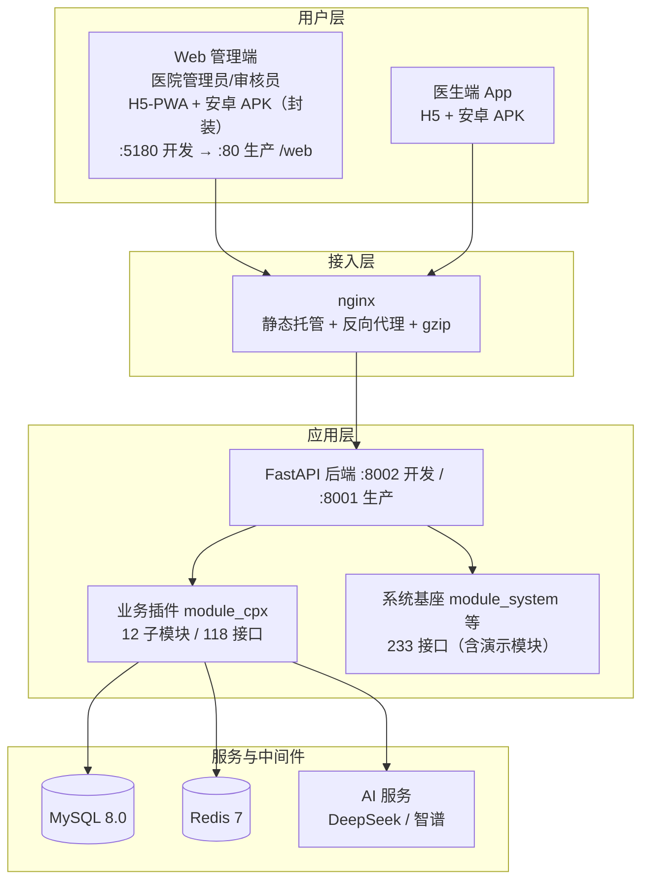

# 智慧胸痛中心管理系统 — 系统架构设计文档

> 版本：v1.1 | 生成日期：2026-09-07（v1.1 修订：校正 cpx 接口 116→118、基座接口 214→233，均按真实代码重新统计）
> 依据：全部取自仓库真实配置与代码（`docker-compose.yml`、`backend/env/.env.prod`、`frontend/web/nginx/default.conf`、`frontend/web/.env.production`、`frontend/app/manifest.config.ts`、`package.json`、`backend/app/plugin/module_cpx/`）
> 说明：本文所有端口、服务名、构建命令、包名、密钥位均为实测值；占位符（`<...>`）表示需人工填写项。

---

## 1. 架构总览

### 1.1 系统分层



### 1.2 三端职责

| 端 | 技术 | 用户 | 核心职责 |
|---|---|---|---|
| Web 管理端 | Vue3 + Element Plus | 管理员、审核员 | 病例管理、审核、模板配置、统计、内容运营 |
| 医生端 App | UniApp + @wot-ui/ui | 医生 | 建档、填报、随访、远程心电、AI 辅助、学习 |
| 后端 API | FastAPI | — | 统一业务与数据服务（三端共用一套） |

---

## 2. 技术选型与理由

### 2.1 后端

| 选型 | 版本 | 选择理由 | 被否方案 |
|---|---|---|---|
| **FastAPI** | 0.138 | 原生异步高并发；自动生成 OpenAPI/Swagger（本项目直接用作接口契约）；Pydantic 入参校验减少 50% 样板代码 | Django（重、同步为主）、Flask（无原生校验/文档） |
| **SQLAlchemy 2.0** | — | `Mapped[]` 类型注解风格，模型即类型声明，IDE 友好 | 裸 SQL（难维护） |
| **MySQL 8.0** | — | 团队既有运维能力；utf8mb4；事务与 JSON 支持 | PostgreSQL（团队熟悉度低） |
| **Redis 7** | — | 会话（`cpx_session` 前缀，db=1）、缓存 | 纯 DB 会话（性能差） |
| **Alembic** | — | 数据库版本化迁移（`main.py upgrade`） | 手工 SQL 脚本 |
| **JWT 自研鉴权** | — | 轻量、无第三方依赖；配合 `BusinessRole` 做接口级角色校验 | 第三方 OAuth（未引入） |

### 2.2 Web 管理端

| 选型 | 版本 | 选择理由 | 被否方案 |
|---|---|---|---|
| **Vue 3** | 3.5 | 组合式 API；生态成熟 | React（团队栈不统一） |
| **Vite** | 7 | 秒级 HMR；`viteCompression` 产出 `.gz/.br` 预压缩 | Webpack（慢） |
| **Element Plus** | 2.14 | 后台管理组件最全（表格/表单/弹窗开箱即用） | Ant Design Vue |
| **Pinia** | — | Vue3 官方状态库，比 Vuex 简洁 | Vuex |
| **ECharts** | 6 | 数据大屏与统计图表 | 国外图表库（中文文档弱） |

### 2.3 医生端 App（多端框架）

| 选型 | 版本 | 选择理由 | 被否方案 |
|---|---|---|---|
| **uni-app** | 3.0 | **一套 Vue3 代码编译到 15+ 端**（H5/微信/支付宝/百度/QQ/抖音/快手/飞书/小红书/360/京东/快应用 + Android/iOS/鸿蒙），本项目医生端需覆盖多端，原生开发成本不可接受 | 各端原生开发（成本 ×N）、Flutter（小程序支持弱） |
| **Vue 3** | — | 与 Web 端同栈，团队复用 | — |
| **@wot-ui/ui** | 2.2 | 移动端组件库，适配小程序/App | Vant（小程序适配一般） |
| **@alova/adapter-uniapp** | — | 轻量请求库，专为 uni-app 适配，带缓存/重试 | axios（小程序兼容差） |
| **高德地图 SDK** | — | 胸痛救治单元定位/导航（Maps + Geolocation 模块） | 腾讯地图 |

### 2.4 部署与运维

| 选型 | 理由 |
|---|---|
| **Docker Compose 全容器化** | 四服务（mysql/redis/backend/web）一键编排；开发-生产环境一致 |
| **nginx** | 静态托管 + API 反代 + gzip/静态预压缩（曾因未开 gzip 导致 Web 慢） |
| **腾讯云轻量 2C2G** | 成本可控；据此做了内存上限优化（见 §7.3） |

### 2.5 AI 服务

| 能力 | 选型 | 理由 |
|---|---|---|
| 知识库问答 / 通用推理 | **DeepSeek** | 中文强、成本低，`deepseek-v4-flash` |
| 图片视觉识别 | **DeepSeek Vision**（`deepseek-v4-flash-vision-exp`） | 复用同一 Key，免额外额度 |
| 语音识别 ASR | **智谱 GLM-ASR-2512** | 中文语音转写 |
| 心电 AI 诊断 | DeepSeek + 智谱视觉 | 多模态协同 |

> ⚠️ 代码注释中 `ai/recognize` 写"通义千问 Vision"已过时，**实际以 `env/.env.dev` 配置为准**。

---

## 3. 后端架构设计

### 3.1 分层

```
controller（路由/入参校验） → service（业务逻辑） → models（ORM 持久化）
                          ↘ schema（请求/响应结构）
```

### 3.2 动态路由插件机制（核心设计）

`app/core/discover.py` 扫描 `module_*/**/controller.py`，**目录名自动映射为 URL 前缀**（`module_xxx` → `/xxx`），新增模块零注册。

**业务代码与框架基座隔离**：胸痛业务全部在 `app/plugin/module_cpx/`（12 子模块、118 接口），框架能力在 `app/api/v1/`（233 接口，含 framework 演示模块 `module_example` 9 个、真实框架基座 224 个）。业务升级不影响基座，基座升级不污染业务。

**cpx 业务子模块接口分布（按真实代码统计，合计 118）**：

| 子模块 | 接口数 | 子模块 | 接口数 |
|---|---|---|---|
| doctor 医生 | 37 | template 模板 | 14 |
| case 病例 | 12 | academy 学院 | 9 |
| audit 审核 | 7 | announcement 公告 | 9 |
| auth 认证 | 3 | user 用户 | 9 |
| hospital 医院 | 6 | value_added 增值 | 8 |
| log 日志 | 2 | stats 统计 | 2 |

### 3.3 关键机制

| 机制 | 实现 | 说明 |
|---|---|---|
| 鉴权 | JWT + `BusinessRole([admin/auditor/doctor])` | 接口级角色校验 |
| PII 加密 | Fernet（`core/crypto.py`） | `phone/id_number/insurance_no` → EncryptedString(255)；`form_data` → EncryptedJson。ORM 层自动加解密 |
| 静态文件鉴权 | HMAC-SHA256 签名 URL（`core/signed_url.py`，默认 24h） | 无签名/过期/篡改 → 403 |
| 字段字典 | `module_cpx/fields.py`（67 标准字段） | 一处定义，Web 与 App 表单共用 |
| 动态模板 | `report_template` + `template_field` | 表单结构可配置，无需改代码 |

---

## 4. 前端架构设计

### 4.1 Web 管理端

- 路由：动态路由加载（`route-loader` + `MenuProcessor`）+ 路由守卫
- 状态：Pinia（用户/菜单/字典/工单/设置/聊天）
- 业务页集中在 `src/views/cpx/`（病例/审核/模板/大屏/学院/公告/增值/日志）
- 生产构建：**必须用 `build:prod`**（`vite build --mode production`）；`build` 含 `vue-tsc` 会因 4 处存量类型错误卡住

### 4.2 医生端 App

- 页面：`src/pages/`（主包）+ `src/subPages/`（分包）
- **导航标题权威源 = `pages.config.ts`**（`pages.json` 由 `vite-plugin-uni-pages` 自动生成，不可手改）
- **manifest 权威源 = `manifest.config.ts`**（`src/manifest.json` 是构建产物，会被覆盖，不可手改）
- 能力：定位/地图（高德）、拍照上传、AI 识别、语音录入

---

## 5. 多端分发方案 ★

### 5.1 分发矩阵

> **实际投产口径**：医生端（uni-app）与管理端（Web，管理员/审核员共用同一应用）均只实际分发 **安卓 APK + H5(PWA)** 两种形态；iOS / 鸿蒙 / 微信及各类小程序 / 快应用 均为 uni-app 框架的可选能力，**当前未启用、非实际分发端**。下表保留作能力清单，状态列已据实标注。

| 端 | 构建命令 | 产物 | 分发方式 | 状态 |
|---|---|---|---|---|
| **Web 管理端（管理员/审核员）** | `pnpm build:prod` | 静态文件（含 `.gz/.br`，H5-PWA 宿主） | Docker nginx `/web`；service-worker 启用 PWA | ✅ 生产在用（H5-PWA） |
| **Web 管理端 · 安卓 APK** | 外部工具封装（HBuilderX「网站打包为 App」/Capacitor），仓库无构建配置 | APK（WebView 封装 H5） | 直接装机 / 应用市场 | ✅ 在用（封装） |
| **App · H5** | `pnpm build:h5` | H5 静态资源 | 浏览器/嵌入（开发验证 :5190） | ✅ 可用 |
| **App · Android** | `pnpm build:app-android` + HBuilderX 云打包 | APK（约 26.8MB，含高德 SDK） | 直接装机 / 应用市场 | ✅ 在用 |
| **App · iOS** | `pnpm build:app-ios` | IPA | 需 Apple 开发者账号 | ⚠️ 未启用（非实际分发端） |
| **App · 鸿蒙** | `pnpm build:app-harmony` | 鸿蒙包 | 需鸿蒙生态配置 | ⚠️ 未启用（非实际分发端） |
| **App · 微信小程序** | `pnpm build:mp-weixin` | 小程序包 | 微信开发者工具上传 | ⚠️ 未启用（非实际分发端，appid 占位） |
| **App · 其它小程序** | `build:mp-alipay / mp-baidu / mp-qq / mp-toutiao / mp-kuaishou / mp-lark / mp-xhs / mp-360 / mp-jd` | 各平台包 | 各平台开发者工具 | ⚠️ 未启用（非实际分发端） |
| **快应用** | `build:quickapp-webview` 等 | 快应用包 | 厂商联盟 | ⚠️ 未启用（非实际分发端） |

### 5.2 App 打包身份（manifest.config.ts 实测）

| 项 | 值 |
|---|---|
| 应用名 | 智慧胸痛管理 |
| appid | `__UNI__17F453C` |
| 版本 | versionName `1.0.0` / versionCode `100` |
| Android 包名 | `com.cpx.xiongtong` |
| 模块 | Maps + Geolocation（缺一不可） |
| 高德 Key | `appkey_android`（绑定包名 + 打包证书 SHA1） |
| 定位权限 | ACCESS_FINE_LOCATION + ACCESS_COARSE_LOCATION |
| 微信小程序 appid | 占位值，**代码注释标注 TODO 需替换**；小程序非实际分发端，appid 占位不影响投产 |

> ⚠️ **APK 打包红线**：
> 1. 改 manifest 必须改 `manifest.config.ts`，改 `src/manifest.json` 会在下次构建被覆盖（徒劳）
> 2. HBuilderX 可视化保存改的是磁盘 `manifest.json`（产物），同样无效
> 3. 装机前自检：带高德 SDK 的包约 **26.8MB**；无地图模块的废包恒定 **15,238,917 B**
>
> ⚠️ **Web 管理端（管理员/审核员）APK 封装说明**：管理端安卓 APK 由外部工具（HBuilderX「网站打包为 App」/Capacitor）把已构建的 H5 封装为 WebView APK 产出，**仓库内不含 PWA/APK 构建配置**，属交付封装产物而非源码构建产物；其实际投产形态与医生端 APK 并列，但技术路径不同（WebView 封装 vs uni-app 原生编译）。

### 5.3 Web 端分发（nginx）

| 路径 | 规则 | 目标 |
|---|---|---|
| `/web` | 静态托管 `try_files → /web/index.html` | 前端产物（base=/web） |
| `/api/` | 反代 `http://backend:8001` | 业务与系统 API |
| `/common/` | 反代 backend | 文件上传 |
| `/static/` | 反代 backend | 上传文件（签名鉴权） |
| `/api/v1/system/chat/ws` | 反代 + `Upgrade/Connection` 头 | WebSocket（客服聊天） |
| `= /favicon.ico` | 301 → `/web/favicon.ico` | 图标兜底 |

关键细节：
- 开启 `gzip on` + `gzip_static on`（优先命中构建产物的 `.gz` 预压缩）
- 反代恒传 `X-Forwarded-Proto https`，否则后端 `HTTPSRedirect` 中间件会把 http 请求 301 到未开放的 443
- Web 生产 `VITE_API_URL = /`（同域，由 nginx 反代，无需写死后端地址）

### 5.4 版本与升级策略

- Web：重新构建镜像 → `docker compose up -d --build web`（用户强刷即生效）
- App H5：重新构建部署，用户刷新生效
- App 原生（APK/iOS/小程序）：**必须重新打包 + 用户更新安装**；版本号在 `manifest.config.ts`（versionName/versionCode）
- 后端：`docker compose up -d --build backend`（注意：只 `docker cp` 单文件进容器不会固化到镜像，重建会回退）

---

## 6. 部署架构

### 6.1 容器编排（docker-compose.yml 实测）

| 服务 | 镜像/构建 | 端口映射 | 内存上限 | 持久化 |
|---|---|---|---|---|
| mysql | `mysql:8.0` | **不映射**（内网） | 512M | `mysql_data` |
| redis | `redis:7-alpine` | **不映射**（内网） | 160M | `redis_data` |
| backend | `./backend/Dockerfile` | `8001:8001` | 512M | `backend_static:/app/static` |
| web | `./frontend/web/Dockerfile`（nginx） | `80:80` | 不限 | — |

网络：单一 `cpx` bridge 网络；DB/Redis 仅容器内网访问，仅暴露 backend 8001 与 web 80。

### 6.2 关键配置

| 项 | 值 | 位置 |
|---|---|---|
| 环境变量 | `ENVIRONMENT=prod`、`SERVER_PORT=8001` | `backend/env/.env.prod` |
| 数据库地址 | `DATABASE_HOST=mysql`（容器服务名） | 同上 |
| Redis | `REDIS_HOST=redis`、`REDIS_DB_NAME=1` | 同上 |
| CORS | `PROD_CORS_ORIGINS` | 同上 |
| MySQL 优化 | 关 performance_schema + `innodb-buffer-pool-size=128M` | compose command |
| Redis 优化 | `--maxmemory 128mb --maxmemory-policy allkeys-lru` + AOF | compose command |

### 6.3 2G 内存约束下的设计取舍

总内存上限约 1.18G（512+160+512）+ 系统余量，因此：
- MySQL 关闭 performance_schema、缓冲池降到 128M
- Redis 限制 128MB 并启用 LRU 淘汰
- 后端限制 512M
- **构建期**：需开 swap（服务器已配 3.9G），否则 `build` 阶段易 OOM

---

## 7. 数据架构

| 项 | 设计 |
|---|---|
| 主存储 | MySQL 8.0，20 张业务表，utf8mb4 |
| 缓存/会话 | Redis 7（db=1，`cpx_session` 前缀） |
| 文件存储 | 本地卷 `backend_static` → `/app/static`（医生照片/会议 PPT/认证库/心电图） |
| 迁移 | Alembic（`python main.py upgrade --env=prod`） |
| 敏感数据 | Fernet 列加密（4 个字段），列宽必须 255 |
| 备份 | ⚠️ 依赖 `mysql_data` 卷，需自行规划定期备份 |

---

## 8. 安全架构

| 层 | 措施 |
|---|---|
| 传输 | 生产 HTTPS（nginx TLS 终结）；`HTTPSRedirect` 中间件 |
| 认证 | JWT；接口级 `BusinessRole` 角色校验 |
| 授权 | admin / auditor / doctor 三级角色隔离 |
| 数据 | 患者 PII（电话/证件号/医保号/表单 JSON）Fernet 加密 |
| 文件 | 静态资源 HMAC 签名 URL（24h 有效），无签名 403 |
| 接口文档 | 生产环境关闭 `/docs` / `/redoc` |
| 密钥 | 全部走 `env_file` 挂载，**不烤进镜像** |

---

## 9. 非功能性设计

| 维度 | 设计 |
|---|---|
| 性能 | nginx gzip + 预压缩 `.gz`；Redis 缓存；列表分页 |
| 可用性 | 容器 `restart: unless-stopped`；MySQL/Redis healthcheck；backend 依赖 DB 健康后才启动 |
| 可扩展 | 插件化业务模块 + 动态路由；新增业务只需加目录 + `controller.py` |
| 可观测 | 系统日志表 `system_log` + 业务日志模块；容器日志 |
| 可维护 | 三端同栈（Vue3）；业务与基座隔离 |

---

## 10. 架构决策记录（ADR）

| # | 决策 | 理由 | 代价/风险 |
|---|---|---|---|
| ADR-1 | 后端选 FastAPI 而非 Django | 异步 + 自动 OpenAPI（直接作契约） | 生态不如 Django 全 |
| ADR-2 | 业务放 `plugin/module_cpx` 插件目录 | 与框架基座解耦，动态路由零注册 | 需理解 discover 机制 |
| ADR-3 | App 用 uni-app 一套代码多端 | 15+ 端覆盖，成本从 ×N 降到 ×1 | 部分原生能力需条件编译 |
| ADR-4 | 字段字典驱动填报（67 字段） | 一处定义两端复用，改字段不改代码 | 早期未做全，老病例仅 6 字段 |
| ADR-5 | 患者 PII 用 Fernet 列加密 | 满足隐私合规，ORM 层无感 | 列须加宽 255；轮换需全量重跑 |
| ADR-6 | 静态文件签名 URL 鉴权 | 防止未授权访问上传文件 | URL 有时效，需后端统一生成 |
| ADR-7 | 全容器化 + nginx 反代 | 环境一致、一键部署；2G 内存可跑 | 构建期需 swap |
| ADR-8 | AI 按能力分模型（DeepSeek + 智谱） | 视觉/ASR/推理各自最优性价比 | 多 Key 管理成本 |

---

## 11. 附录：待填配置清单（上线前必须替换）

| 项 | 位置 | 状态 |
|---|---|---|
| `MYSQL_ROOT_PASSWORD` | 根目录 `.env` / compose | 默认 `cpx_dev_pwd` 仅冒烟 |
| `SECRET_KEY` | `backend/env/.env.prod` | 占位，需 `openssl rand -hex 32` |
| `DEEPSEEK_API_KEY` | 同上 | 占位 |
| `ZHIPU_API_KEY` | 同上 | 占位 |
| `PROD_CORS_ORIGINS` | 同上 | 占位，需填实际域名/IP |
| `VITE_APP_WS_ENDPOINT` | `frontend/web/.env.production` | 占位 `ws://<服务器IP或域名>` |
| `VITE_LOCK_ENCRYPT_KEY` | 同上 | 占位，建议改随机串 |
| 微信小程序 appid | `frontend/app/manifest.config.ts` | 代码注释标注 TODO |
| 高德 Key 绑定 | 高德开放平台 | 已配 key，需绑包名 + 证书 SHA1 |

---

## 12. 剔除声明（避免虚构）

| 不包含 | 说明 |
|---|---|
| Kubernetes / 服务网格 | 本项目用 Docker Compose 单机编排，无 K8s |
| 对象存储（S3/OSS/COS）作为业务存储 | `module_storage` 有适配器但业务上传走本地卷 `/app/static` |
| 消息队列（Kafka/RabbitMQ） | 无；异步任务用 APScheduler（框架基座） |
| 邮件/SMS 网关 | 无 SMTP 实现 |
| 移动端热更新 | App 原生端需重新打包安装 |
| DataMAX 大屏 | 云端外部服务，不在本仓库 |
| iOS / 鸿蒙 / 微信及各类小程序 / 快应用多端 | 仅 uni-app 框架可选编译目标，当前**未实际投产**（实际分发仅 安卓 APK + H5-PWA） |
