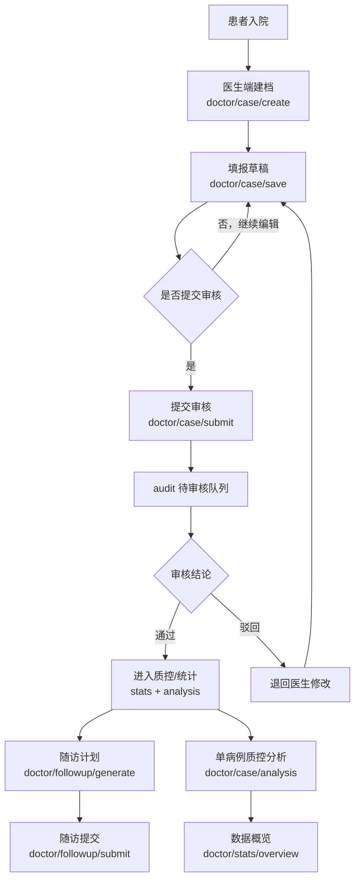
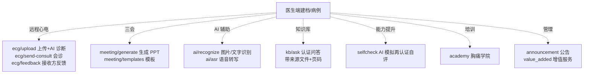
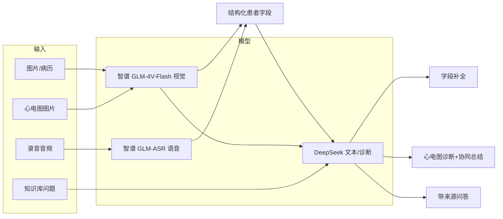

# 智慧胸痛中心管理平台 · 系统流程图

> 2026-08-31 基于当前代码重新生成。描述「患者建档 → 填报 → 审核 → 质控 → 随访」主流程，以及各增值模块的挂载点。
> 图中节点对应真实接口/模块（前缀 `/api/v1/cpx/...`）。

---

## 一、核心业务主流程

---

## 二、增值模块挂载点

以下模块都在「建档/病例」节点上扩展，不阻塞主审核流：

---

## 三、关键状态流转（病例）

| 阶段 | 触发接口 | 状态/落库 |
|---|---|---|
| 建档 | `POST /cpx/doctor/case/create` | 生成病例编号 `case_no`，初始为草稿 |
| 保存草稿 | `POST /cpx/doctor/case/{id}/save` | 更新 `form_data`（全量字段） |
| 提交审核 | `POST /cpx/doctor/case/{id}/submit` | 进入 `audit` 待审核队列 |
| 审核通过 | `audit.approve` | 标记通过，纳入质控统计 |
| 审核驳回 | `audit.reject` | 退回医生，可再次编辑提交 |
| 生成随访 | `POST /cpx/doctor/followup/generate` | 按通过病例生成随访计划 |

---

## 四、AI 链路（仅 3 个真实功能）

> 说明：以上 3 个 AI 功能（数据填报 AI 识别+语音识别、心电图 AI 诊断+协同总结、认证知识库问答）为真实调用 LLM；`module_ai/chat`（通用 AI 对话）为孤儿功能，未接入页面，不在流程图中。
