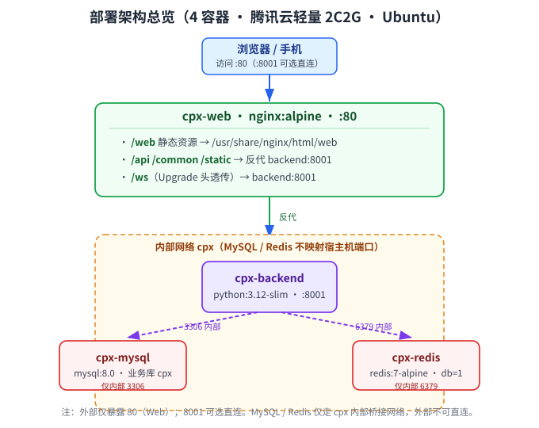

# 胸痛中心管理系统 — 部署文档（Docker 容器化 + 多端访问）

> 版本：v1.1 | 生成日期：2026-09-07
> 依据：仓库真实部署文件（`docker-compose.yml`、各 `Dockerfile`、`docker-entrypoint.sh`、`frontend/web/nginx/default.conf`、`.env.prod`、`vite.config.ts`）+ 线上服务器实测状态
> 范围：Docker 容器化部署、前后端联调机制、Web 管理端 / 医生端 App 多端访问方式、Demo 访问地址

---

## 1. 部署架构总览

整套系统以 **4 个容器** 全量容器化运行（宿主机为腾讯云轻量 2C2G / Ubuntu），对外仅暴露 `80`（Web）与 `8001`（后端 API，可选）。



**容器清单（实测运行中）**

| 容器 | 镜像 | 内存上限 | 端口映射 | 说明 |
|---|---|---|---|---|
| cpx-mysql | mysql:8.0 | 512M | 仅内部 3306 | 业务库 `cpx`；关闭 performance_schema、innodb_buffer 128M（2G 优化） |
| cpx-redis | redis:7-alpine | 160M | 仅内部 6379 | maxmemory 128mb + allkeys-lru；db=1 与会话前缀 `cpx_session` 一致 |
| cpx-backend | python:3.12-slim（自构建） | 512M | `8001:8001` | 启动顺序：等 MySQL 就绪 → `alembic upgrade` → `uvicorn :8001` |
| cpx-web | nginx:alpine（自构建） | 不限 | `80:80` | 托管 Web 管理端 + 反代后端 API |

> MySQL / Redis **不映射宿主机端口**，仅走 `cpx` 内部桥接网络，外部不可直连，安全性更高。

---

## 2. 环境与前置要求

| 项 | 要求 | 实测 |
|---|---|---|
| 服务器 | 2C2G 以上（本机 2G，已配 3.9G swap 防 OOM） | 腾讯云轻量 106.55.33.111 / Ubuntu |
| Docker | 20.10+，含 `docker compose` | 已就绪 |
| Docker Compose | v2（`docker compose` 子命令） | 已就绪 |
| 防火墙 | 放通 **80**（Web）；如需直连 API 再放 8001 | 80 已放通 |
| 域名（可选） | 绑定后追加到 `ALLOWED_HOSTS` 与 `PROD_CORS_ORIGINS` | 当前用公网 IP |

---

## 3. Docker 容器化部署步骤

### 3.1 准备密钥（必做，否则服务起不来或安全风险）
编辑 `backend/env/.env.prod`，把下列 `<占位>` 换成真实值（文件可进仓库，仅占位无真实密钥）：

| 配置项 | 说明 |
|---|---|
| `MYSQL_ROOT_PASSWORD` | 在 `docker-compose.yml` 与 `.env.prod` 的 `DATABASE_PASSWORD` **两处保持一致** |
| `REDIS_PASSWORD` | 留空或设置；与 `docker-compose.yml` 的 redis 配置对应 |
| `SECRET_KEY` | `openssl rand -hex 32` 生成的随机串（JWT 签名，必改） |
| `PROD_CORS_ORIGINS` | `http://<服务器IP或域名>`（与访问地址一致） |
| `ALLOWED_HOSTS` | 追加 `"<服务器IP>"` 与域名（缺则浏览器访问返回 400 Invalid host header） |
| `DEEPSEEK_API_KEY` / `ZHIPU_API_KEY` | AI 链路（填报识别 / 心电图诊断 / 知识库问答）；留空则 AI 降级，不影响主流程 |
| `VITE_APP_WS_ENDPOINT` | `frontend/web/.env.production` 里的 `ws://<服务器IP或域名>`（WebSocket 端点） |

### 3.2 一键构建并启动
仓库根目录执行（等价于 `deploy.sh` 的无拉码版）：

```bash
# 在服务器 /home/ubuntu/cpx 下
docker compose up -d --build
```

启动序列（由 `docker-entrypoint.sh` 保证）：
1. `cpx-mysql` / `cpx-redis` 健康检查通过（`service_healthy`）
2. `cpx-backend` 启动 → 等 MySQL 端口 → `python main.py upgrade --env=prod`（自动迁移）→ `python main.py run --env=prod`
3. `cpx-web` 启动 nginx，托管 `/web` 静态 + 反代 `/api`

### 3.3 校验
```bash
docker compose ps                       # 四容器状态应为 Up / healthy
docker compose logs --tail=50 backend  # 看迁移与 uvicorn 启动日志
```

---

## 4. 前后端联调机制（同域，无需跨域）

| 机制 | 实现 | 说明 |
|---|---|---|
| 前端 base 路径 | `vite.config.ts` `base: VITE_BASE_URL`（= `/web`） | 构建产物落在 `dist/`，nginx 以 `/web` 提供 |
| API 同域 | 浏览器请求 `/api/v1/*` → nginx `location /api/` 反代 `backend:8001` | 前端不写死后端地址，`VITE_API_URL=/` |
| 上传/静态 | `/common/`、`/static/` 反代 backend | 医生照片 / 会议 PPTX / 认证库 / 心电图图由后端提供 |
| WebSocket | `/api/v1/system/chat/ws`、`/api/v1/ai/chat/ws` 带 `Upgrade/Connection` 头透传 | AI 对话、人工客服实时通道 |
| HTTPS 透传 | nginx 恒传 `X-Forwarded-Proto https` | 避免后端 `HTTPSRedirect` 把 http 握手 301 到未开放的 443 |
| 静态压缩 | nginx 开 `gzip` + `gzip_static`（命中 `.gz/.br` 预压缩） | 解决 Web 打开慢 |

> 联调要点：浏览器只认 `http(s)://<ip>/web`，所有后端调用经 nginx 同域转发，**生产环境不需要配 CORS 跨域**（CORS 仅当 API 独立域名时填 `PROD_CORS_ORIGINS`）。

---

## 5. 多端访问方式

| 端 | 应用 | 访问形态 | 当前状态 | 访问地址 |
|---|---|---|---|---|
| Web 管理端 | `frontend/web`（管理员 / 审核员共用） | 浏览器打开 `/web` | ✅ **线上已托管** | `http://106.55.33.111/web/` |
| 医生端 App · H5 | `frontend/app`（`build:h5`） | 手机浏览器打开 H5 | ⚠️ **线上未托管**（见 §5.1） | 规划 `http://106.55.33.111/app` |
| 医生端 App · APK | `frontend/app`（HBuilderX 云打包） | 安卓装机 | 需出包后分发 | 由打包产物分发 |
| 微信/支付宝/百度/QQ/头条小程序、iOS、鸿蒙 | — | — | ⚠️ 未启用（仅框架编译目标） | — |

### 5.1 医生端 H5 启用步骤（补充，当前线上缺位）
当前 `docker-compose.yml` 与 `nginx/default.conf` **只托管 Web 管理端**，医生端 H5 无容器承载。轻量启用方案（不重建镜像，改动线上 nginx + 静态文件，需确认后执行）：

1. 在服务器构建 App H5：`cd /home/ubuntu/cpx/frontend/app && pnpm install && pnpm build:h5`（产物 `dist/build/h5/`）。
2. 拷入 web 容器：`docker cp dist/build/h5/. cpx-web:/usr/share/nginx/html/app`
3. 在 `nginx/default.conf` 增加 `location /app { root /usr/share/nginx/html; try_files $uri $uri/ /app/index.html; }`，`docker exec cpx-web nginx -s reload`。
4. 验证：`curl -o /dev/null -w '%{http_code}' http://localhost:80/app/` → 200。

> 启用后会得到可直接在手机浏览器打开的医生端 H5 地址 `http://106.55.33.111/app`。**此步涉及线上容器改动，按协作约定需你确认后再执行。**

---

## 6. 运维命令

| 场景 | 命令（仓库根 / `/home/ubuntu/cpx`） |
|---|---|
| 查看状态 | `docker compose ps` |
| 查看日志 | `docker compose logs --tail=100 backend` / `web` |
| 重启 | `docker compose restart` |
| 停机 | `docker compose down` |
| 重新构建 | `docker compose up -d --build` |
| 数据库迁移 | 后端容器内 `python main.py upgrade --env=prod`（entrypoint 已自动执行） |

> 仓库自带 `deploy.sh` 为上游模板（指向 gitee / 旧目录），**不要用**；直接用根 `docker-compose.yml` + 上方命令。

---

## 7. 验证清单（部署后探活）

```bash
# 1) Web 管理端（期望 301→/web/，最终 200）
curl -s -o /dev/null -w '%{http_code} %{redirect_url}\n' http://<IP>/web

# 2) 后端 API 经 nginx 反代（期望非 502/400）
curl -s -o /dev/null -w '%{http_code}\n' http://<IP>/api/v1/

# 3) 容器健康
docker compose ps | grep -E 'healthy|Up'
```

---

## 8. Demo 访问地址（2026-09-07 实测）

| 端 | 地址 | 状态 | 验证 |
|---|---|---|---|
| **Web 管理端** | **http://106.55.33.111/web/** | ✅ 公网可直连 | 从外部网络 `curl` 返回 **200**（已实测） |
| 医生端 H5 | http://106.55.33.111/app | ⚠️ 未启用 | `/app` 当前 404，需按 §5.1 启用 |
| 医生端 APK | 需云打包后分发 | ⏸️ 待出包 | 见 §5 |

**演示账号（平台级，见设计文档约定 `admin/123456`）**
- 管理员：`admin` / `123456`
- 审核员 / 医生：由管理员在「系统管理 → 用户管理」创建并分配角色（医生初始密码约定 `Aa123456`，可后台重置）
- 若部署时已重置密码，请使用新密码；首次登录建议修改。

> 说明：生产 `DEMO_ENABLE=False`、`DEBUG=False`，无演示数据注入；登录后见真实业务数据（需先建档/填报）。

---

## 9. 待办与风险

| 项 | 风险/影响 | 建议 |
|---|---|---|
| 医生端 H5 未托管 | 移动端只能走 APK，无 H5 演示入口 | 按 §5.1 启用（待确认） |
| 微信小程序 appid 占位 | 小程序端无法发布（非实际分发端） | 按需补真实 appid |
| `.env.prod` 密钥占位 | 留空则不鉴权 / AI 降级 | 部署前填 `SECRET_KEY`、DB/Redis 密码、AI Key |
| 无 HTTPS | 公网明文传输，WS 被迫走 ws:// | 建议前置证书或 CDN 开启 HTTPS，并把 `X-Forwarded-Proto` 改为真实协议 |
| 仅单节点、无备份 | 2G 机器重建有数据丢失风险 | `mysql_data` 卷定期备份；或升级配置 |

---

## 10. 剔除声明（与架构文档一致）

本部署**不含**以下组件（均非虚构、非必需）：Kubernetes / 服务网格 / 消息队列 / 对象存储(S3) / 独立 SMTP 服务 / 多可用区。当前为单宿主机 Docker Compose，满足胸痛中心演示与中小规模生产需求。
