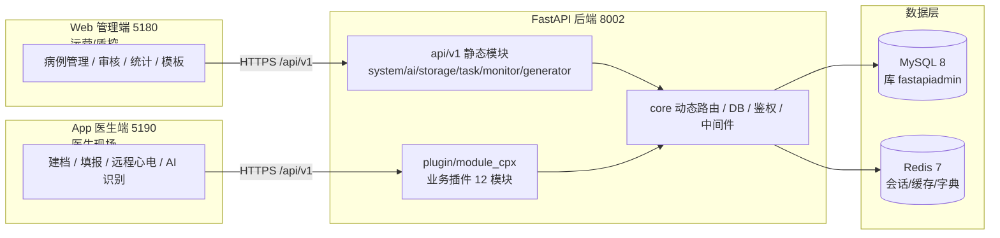
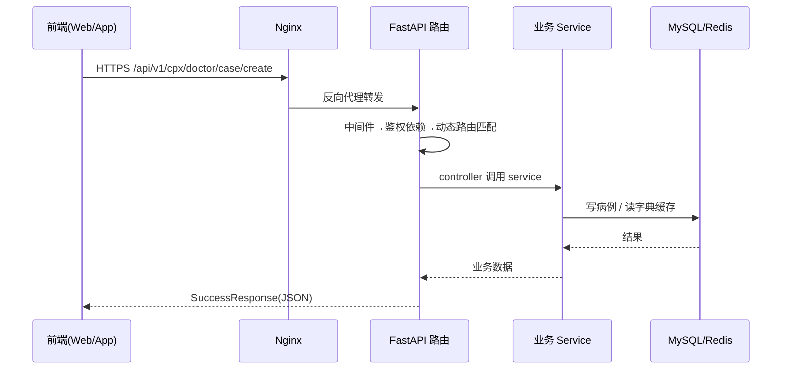
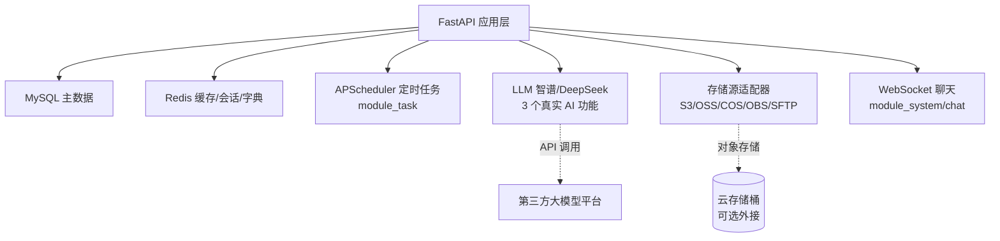

# 智慧胸痛中心管理平台 · 项目总流程图

> 2026-08-31 基于当前代码重新生成。描述三端如何通过后端 API 协作、数据如何流动，以及 AI/存储等支撑链路的边界。

---

## 一、三端协作与数据流

---

## 二、请求生命周期（单条链路拆解）

> 说明：响应统一走 `app/common/response.py` 的 `SuccessResponse` / `ErrorResponse`；全局异常在 `core/exceptions.py` 统一收敛。

---

## 三、支撑链路边界

> 边界说明：
> - **存储源（S5）** 是真实功能（`module_storage` 实现了 S3/OSS/COS/OBS/SFTP 适配器），依赖 `boto3`/`cos-python-sdk-v5` 等；可作为可选外接存储，非业务必需。
> - **WebSocket（S6）** 是真实功能（`module_system/chat` 的 `chat_ws_endpoint`，人工客服/群聊），无 LLM。
> - **DataMAX 大屏** 不在本仓库，属外部云端服务，不在本流程图中。
