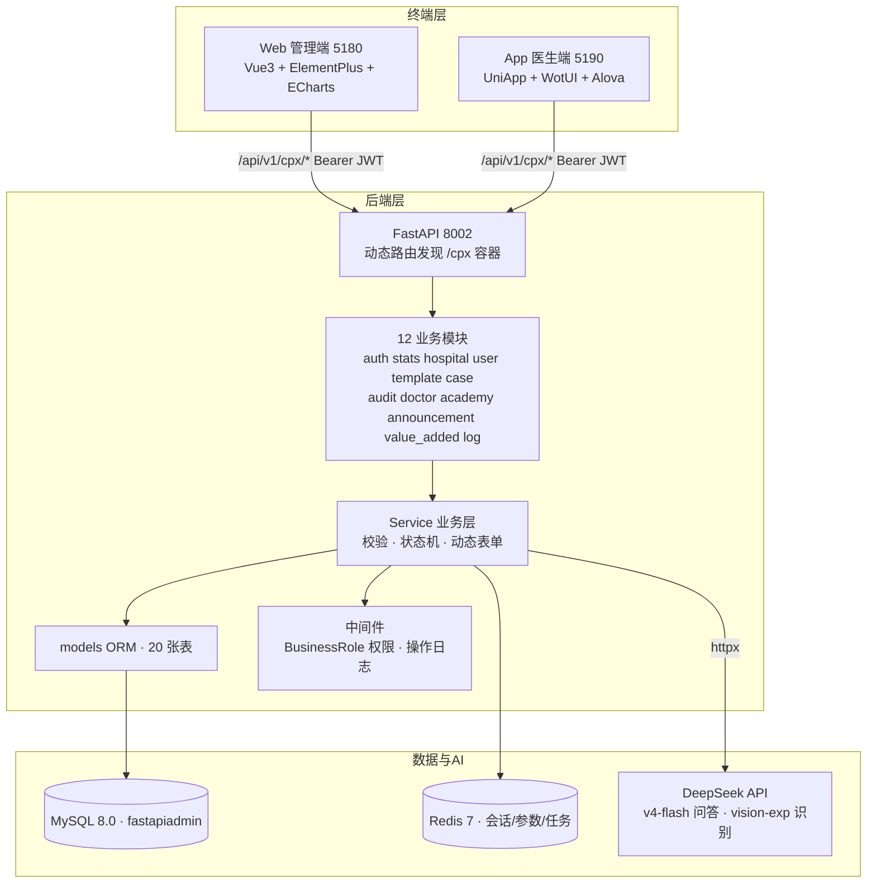

# 智慧胸痛中心管理系统 · 项目框架图

> 基于真实代码目录结构梳理（v3.1.0）。三层架构：FastAPI 后端(8002) + Web 管理端(5180) + UniApp 医生端(5190)。

---

## 一、总览架构



---

## 二、后端目录框架（backend/）

```
backend/
├── main.py                      # FastAPI 入口（create_app 工厂）
├── pyproject.toml               # uv 依赖（Python ≥3.12）
├── env/.env.dev                 # 环境配置（DB/Redis/AI Key/模型）
├── app/
│   ├── init_app.py              # lifespan：初始化 + 数据种子
│   ├── config/
│   │   ├── setting.py           # pydantic-settings 全局配置
│   │   └── path_conf.py         # 路径常量（STATIC_DIR 等）
│   ├── core/                    # 框架核心
│   │   ├── discover.py          # ★动态路由发现（扫描 controller 自动注册）
│   │   ├── database.py          # 异步 SQLAlchemy + MySQL/Redis 连接
│   │   ├── base_model.py        # MappedBase 基类（20 表继承）
│   │   ├── base_crud.py         # 通用 CRUD
│   │   ├── exceptions.py        # CustomException 全局异常
│   │   ├── dependencies.py      # db_getter 依赖
│   │   ├── ap_scheduler.py      # 定时任务（操作日志清理）
│   │   ├── logger.py / middlewares.py / base_schema.py
│   ├── common/                  # 统一响应 SuccessResponse 等
│   ├── plugin/                  # ★业务插件（本项目主体）
│   │   └── module_cpx/
│   │       ├── models.py        # 20 张业务表 ORM（hospital/role/user/case...）
│   │       ├── fields.py        # 标准模板字段集（7 分类 ~60 字段）
│   │       └── {12 模块}/       # 每模块 controller.py + service.py + schema.py
│   │           ├── auth/        # 业务登录认证（BizAuth/BusinessRole）
│   │           ├── stats/       # 驾驶舱/统计分析
│   │           ├── hospital/ user/ template/ case/
│   │           ├── audit/       # 审核工作台（审核员 Web 端操作）
│   │           ├── doctor/      # 医生端核心（填报/随访/心电/三会/AI识别）
│   │           ├── academy/ announcement/ value_added/ log/
│   ├── api/v1/                  # 框架级模块（非胸痛业务）
│   │   ├── module_ai/kb/        # AI 知识库问答（KbService → DeepSeek）
│   │   ├── module_system/       # 后台管理（用户/菜单/角色/字典...）
│   │   ├── module_storage/ module_task/ module_monitor/
│   │   └── module_generator/ module_common/
│   ├── scripts/
│   │   ├── initialize.py        # 建表 + 初始化种子（角色/医院/账号）
│   │   └── seed_dashboard_data.py # 演示数据（病例/审核/随访）
│   └── utils/                   # 通用工具
└── static/uploads/              # 上传图片（心电图/证件等）
```

### 后端关键机制
| 机制 | 位置 | 说明 |
|---|---|---|
| 动态路由 | `core/discover.py` | 扫描 `*/controller.py` 的 `XxxRouter` 自动注册 `/cpx` 容器 |
| 权限隔离 | `auth/dependencies.py` | `BusinessRole([ROLE_ADMIN/AUDITOR/DOCTOR])` 接口级校验 |
| 动态表单 | `case_detail.form_data` JSON | 模板字段驱动，新字段免迁移 |
| 状态机 | case/audit/follow_up | draft→submitted→approved/rejected；随访 1/3/6/12 月 |
| AI 接入 | `doctor/controller.py` + `module_ai/kb` | DeepSeek v4-flash（问答/文字）+ vision-exp（图片，base64 内联） |

---

## 三、Web 管理端目录框架（frontend/web/）

```
frontend/web/
├── index.html                   # VITE_APP_TITLE 注入（智慧胸痛管理）
├── .env.development             # VITE_APP_TITLE / API 地址
├── vite.config.ts / package.json
├── public/                      # favicon/logo
└── src/
    ├── main.ts / App.vue
    ├── api/
    │   ├── cpx/                 # ★业务 API：academy announcement audit case
    │   │                        #   hospital log stats template user value_added
    │   └── ...（框架 API）
    ├── views/
    │   ├── cpx/                 # ★胸痛业务页面
    │   │   ├── dashboard/       # 数据驾驶舱（KPI+3图表）
    │   │   ├── case/ template/ hospital/
    │   │   ├── audit/           # 审核工作台/待审/详情/记录（auditor）
    │   │   ├── academy/ announcement/ value_added/ log/ login/
    │   └── module_system/       # 框架后台（auth/chat/dept/dict/log/menu/
    │                            #   notice/params/position/role/ticket/user/version）
    ├── router/
    │   ├── index.ts
    │   └── MenuProcessor.ts     # ★按角色生成菜单（auditor 有 /cpx/audit）
    ├── store/ hooks/ components/ layouts/
    └── styles/ utils/ types/ config/
```

---

## 四、App 医生端目录框架（frontend/app/）

```
frontend/app/
├── index.html                   # <title>胸痛管理中心</title>
├── .env.development             # VITE_API_BASE_URL=http://192.168.0.35:8002
├── src/
│   ├── main.ts / App.vue
│   ├── pages/                   # ★主包 13 页（vite-plugin-uni-pages 自动注册）
│   │   ├── index/               # 首页工作台（统计+公告+增值服务+8宫格）
│   │   ├── work/                # 数据直报（病例列表/筛选/建档入口）
│   │   ├── case/                # 建档 create + 表单填报 fill + 时间轴 time
│   │   ├── followup/            # 随访管理（按患者聚合）
│   │   ├── analysis/ unit/ meeting/ academy/
│   │   ├── ecg/                 # 远程心电（AI诊断+会诊）
│   │   ├── daily-report/        # 今日报告（统计卡跳转筛选）
│   │   ├── selfcheck/ ai/ mine/ login/
│   ├── subPages/                # 分包：公告详情/通知/工单/设置/关于/AI聊天
│   ├── api/module_cpx/          # ★业务 API（doctor.ts 含 myCases/kbAsk/recognize）
│   ├── http/                    # alova 封装（BASE_URL/鉴权/超时）
│   ├── store/ layouts/          # tabbar 布局（首页/AI助手/我的）
│   ├── static/                  # icons(nav_*.svg)/images(ai-bot.png)/favicon.svg
│   ├── pages.json               # 全局样式/导航栏（胸痛管理中心）
│   └── uni_modules/ uni.scss
```

---

## 五、三端协同数据流

```
Web(管理/配置/统计)          App(医生填报/执行)
    │                            │
    └──────────┬─────────────────┘
               ▼
     /api/v1/cpx/*（Bearer JWT · Redis 会话）
               ▼
    ┌── FastAPI 动态路由 ──┐
    │ Service → models ORM │
    └──────┬────────┬──────┘
           ▼        ▼
    MySQL 20 表    Redis
           │
           ▼
    DeepSeek API（问答/文字/图片识别）
```

### 关键协同链路
1. **配置流**：Web 建模板+发布 → App 按模板填报 → Web 驾驶舱汇总
2. **业务流**：App 医生建档填报提交 → **Web 审核员审核通过** → 自动生成随访计划 → App 随访执行
3. **内容流**：Web 发布公告/增值服务/学院资源 → App 首页实时展示
4. **AI 流**：App 问答/识别 → 后端 → DeepSeek（v4-flash / vision-exp）

---

## 六、技术栈清单

| 层 | 技术 |
|---|---|
| 后端 | FastAPI 0.138 + SQLAlchemy 2.0(异步) + pydantic-settings + Redis + APScheduler + uv |
| 数据库 | MySQL 8.0（库 fastapiadmin，20 表，utf8mb4） |
| Web 端 | Vue3 + Vite 7 + Element Plus + ECharts 6 + Pinia + Tailwind4 |
| App 端 | UniApp + WotUI + Pinia + Alova + vite-plugin-uni-pages |
| AI | DeepSeek OpenAI 兼容（deepseek-v4-flash / deepseek-v4-flash-vision-exp） |
